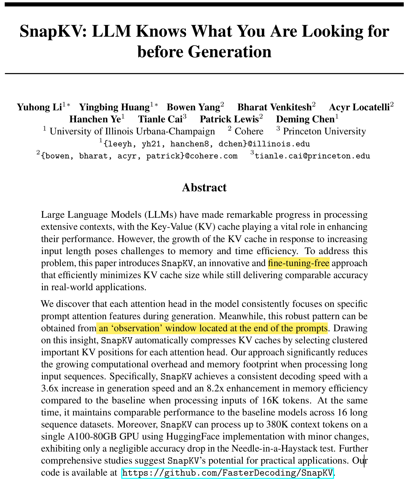
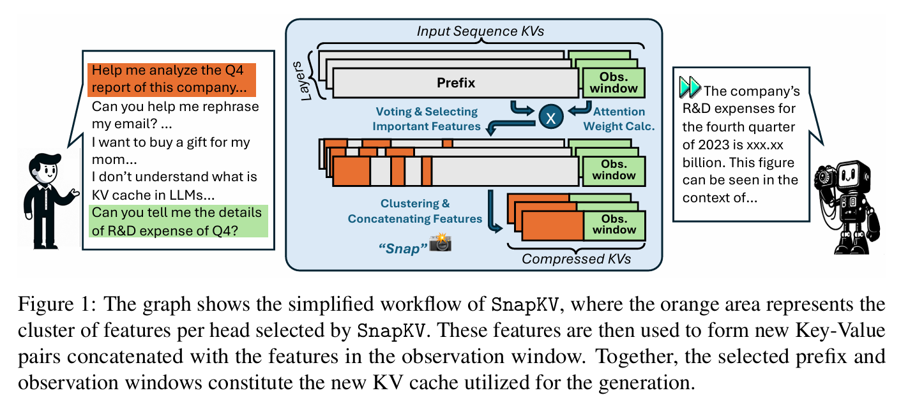
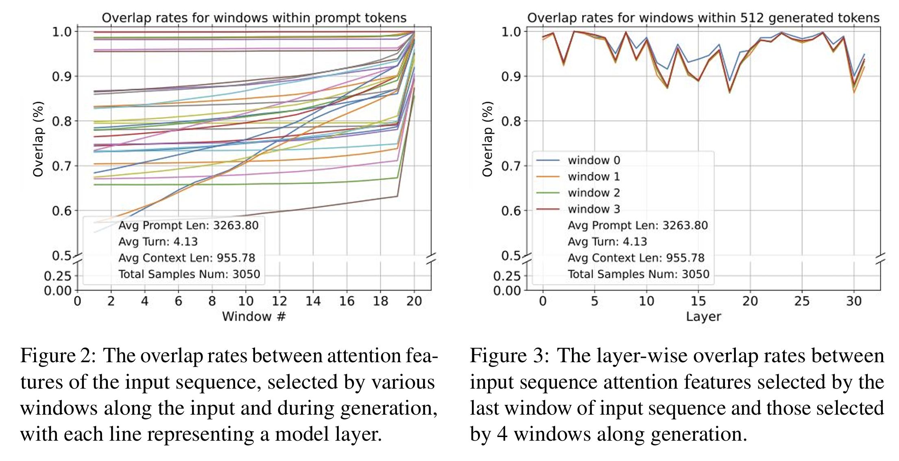
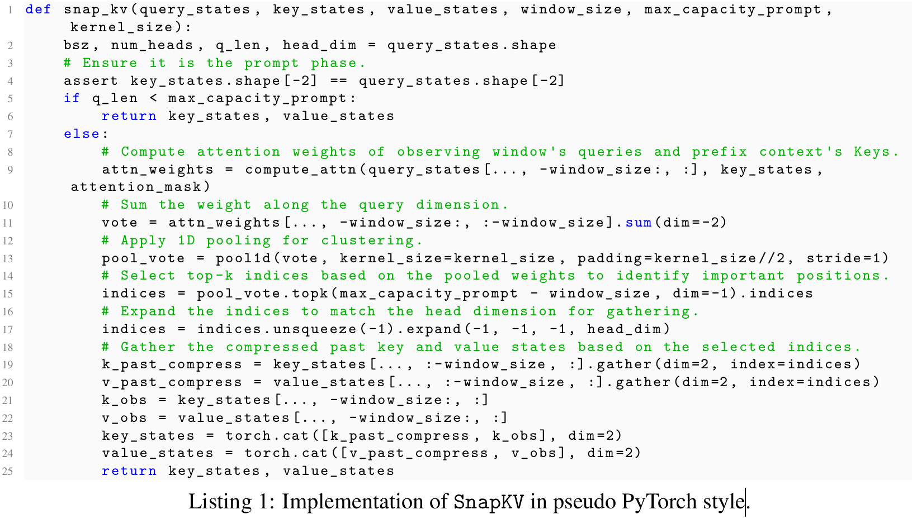
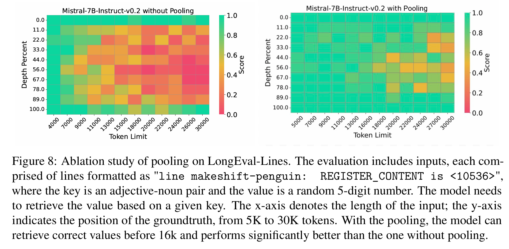
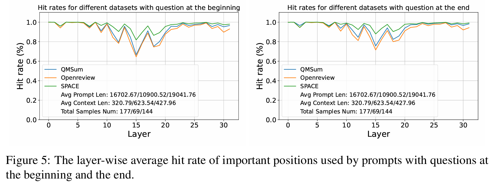
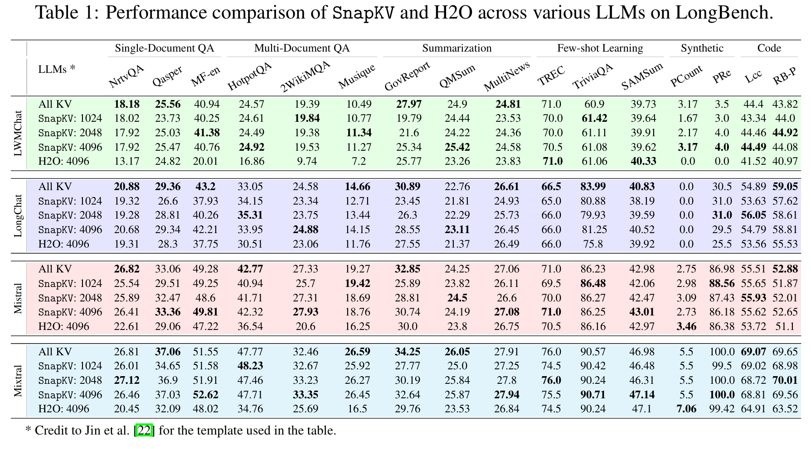
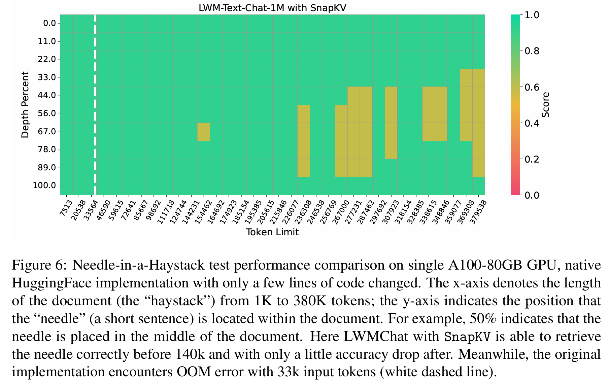
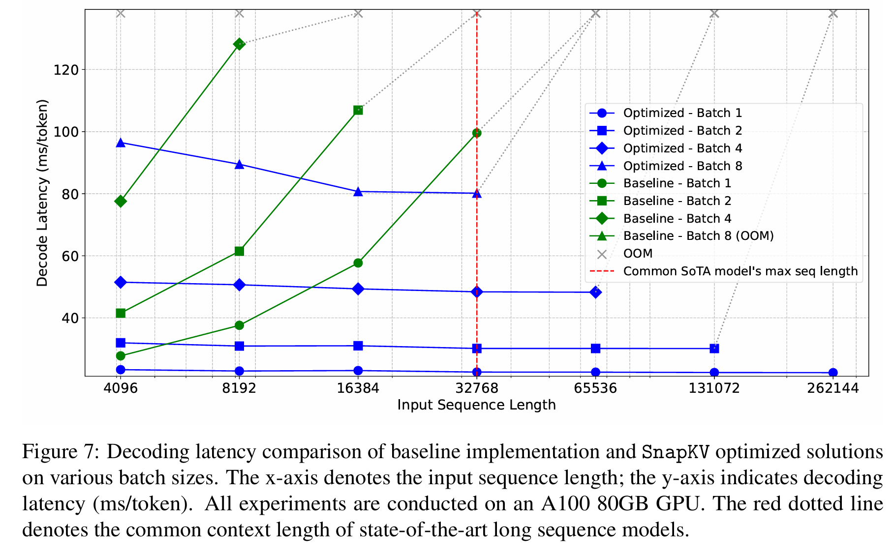

## 1. 一句话概括核心贡献

这篇论文提出了 **SnapKV**：一种 **无需微调、面向长上下文 prompt KV cache 压缩** 的方法，它利用 prompt 末尾 observation window 的注意力模式，提前判断哪些历史 token 对后续生成最重要，并按 attention head 选择和聚类保留关键 KV，从而在基本不损失长文本理解能力的前提下降低显存占用和解码延迟。

---

## 2. 论文要解决的问题及重要性

### 2.1 具体问题

长上下文 LLM 推理时，KV cache 会随着输入 prompt 长度线性增长。对于每一步 decode，新生成 token 的 query 都需要和历史所有 key 做 attention，因此：

* prompt 越长，每步解码的注意力计算越慢；
* KV cache 越大，显存占用越高；
* batch size、最大上下文长度、部署成本都会受到限制。

论文指出，现有很多 KV cache 压缩方法主要关注 **generation 阶段新增 token 的 cache eviction**，而忽略了实际长上下文应用中更大的瓶颈：**prompt KV cache 本身非常长**。例如多轮对话、长文档问答、代码库分析、长报告总结等场景中，输入 prompt 往往远长于输出内容。

### 2.2 为什么重要

对于语义通信或多智能体通信视角，可以把 KV cache 看成模型内部的“语义状态缓存”。长 prompt 的 KV cache 实际上保存了大量上下文语义信息，但并非所有 token 都对当前任务同等重要。如果能在生成前就压缩掉无关 KV，就可以：

* 降低长上下文推理显存需求；
* 提高 token-by-token 解码速度；
* 让单卡处理更长上下文；
* 为后续 KV cache 传输、缓存通信、跨模型语义传递提供压缩思路。

---

## 3. 整体工作流程

### 3.1 输入与输出

**输入：**

* 一个长 prompt，包括长文档、对话历史、问题、指令等；
* 原始 LLM，例如 Mistral、Mixtral、LongChat、LWM-Text-Chat；
* SnapKV 的超参数，包括：

  * observation window size；
  * prompt KV cache 最大容量；
  * pooling kernel size。

**输出：**

* 一个压缩后的 prompt KV cache；
* 后续生成时，模型基于该压缩 KV cache 输出回答。

### 3.2 核心流程

论文图 1 展示了 SnapKV 的简化流程：先将输入 prompt 分成 prefix 和 observation window，再用 observation window 的 query 去观察 prefix 中哪些 KV 重要，然后选择这些重要位置的 KV，并与 observation window 自身的 KV 拼接，形成压缩后的 KV cache。

整体流程可以拆成以下几步：

1. **正常 prefill 长 prompt**
   模型读取完整 prompt，计算每一层、每个 attention head 的 Q/K/V。

2. **划分 prompt**
   prompt 被分为两部分：

   * prefix：前面的大部分上下文；
   * observation window：prompt 末尾的一小段 token。

3. **用 observation window 观察 prefix**
   取 observation window 中 token 的 query，与 prefix 的 key 计算注意力权重。

4. **attention voting**
   对 observation window 内多个 query 的 attention weight 进行累加，得到每个 prefix token 的重要性分数。

5. **pooling 聚类**
   对重要性分数做一维 pooling，使得模型不只保留单个高权重 token，而是倾向于保留一小段连续上下文。

6. **Top-k 选择 KV**
   每个 attention head 独立选择若干 prefix 位置，保留这些位置对应的 K/V。

7. **拼接 observation window KV**
   压缩后的 prefix KV 与完整 observation window KV 拼接，构成新的 prompt KV cache。

8. **进入 generation 阶段**
   后续 decode 时，模型不再 attend 到完整 prompt KV，而是 attend 到压缩后的 prompt KV。这样 prompt 部分的 KV 数量保持常数，解码速度不再随原始 prompt 长度线性增长。

---

## 4. 核心方法解释

## 4.1 Observation Window：为什么看 prompt 末尾？

SnapKV 的核心观察是：**LLM 在正式生成前，已经能从 prompt 末尾的 token 中体现出后续生成时会关注哪些上下文位置。**

论文做了两个观察实验：

* 不同 prompt window 选出的重要 attention 位置，与生成阶段真正关注的位置进行重叠率比较；
* 发现 prompt 最后的 window 与生成阶段的 attention pattern 高度一致；
* 生成过程中，不同生成 window 关注的 prompt token 也比较稳定。

也就是说，LLM 在看到完整 prompt 后，虽然还没有开始正式回答，但 prompt 末尾的 query 已经能“预判”后续回答需要用到哪些上下文信息。论文标题里的 “LLM knows what you are looking for before generation” 指的就是这个现象。

## 4.2 Voting：如何判断哪些 prefix token 重要？

SnapKV 用 observation window 中的 query 对 prefix keys 做 attention，然后把 observation window 内所有 query 对 prefix 的注意力权重累加。
```text
attention logits = Q · K^T / sqrt(d)
attention weights = softmax(attention logits + mask)
```
直观理解：

> 如果 observation window 中很多 token 都频繁关注某个 prefix 位置，那么这个 prefix 位置很可能对后续生成重要。

这个 voting 是按 attention head 分别进行的。也就是说，不同 head 可以选择不同的 token 位置。这一点很关键，因为不同 attention head 可能负责不同类型的信息，例如局部复制、实体检索、格式保持、长程依赖等。

## 4.3 Top-k Selection：如何压缩 KV cache？

得到每个 prefix token 的重要性分数后，SnapKV 对每个 head 选择 Top-k 个重要位置，并把这些位置对应的 K/V gather 出来。

压缩后的 KV cache 不是简单截断前几个 token 或保留最近 token，而是：

* 按当前 prompt 内容动态选择；
* 按当前问题或指令动态选择；
* 按 attention head 分别选择。

因此它比固定保留策略更接近“任务相关语义压缩”。

## 4.4 Pooling：为什么不是只选 attention 最大的 token？

论文认为，直接保留 attention 权重最高的离散 token 会破坏上下文完整性。比如模型可能只保留电话号码中的国家码，却丢掉后面号码；或者只保留实体片段，丢掉周围解释信息。

因此 SnapKV 在 Top-k 之前加入 pooling，使得高 attention token 附近的一段 token 也更容易被保留下来。这相当于一种轻量级的 **局部聚类机制**：

* attention 高的位置是“中心”；
* pooling 让周围 token 也获得较高分数；
* 最终保留的不只是孤立点，而是若干信息片段。

论文在 LongEval-Lines 上的消融实验显示，加 pooling 后信息检索能力明显优于不加 pooling 的版本。

## 4.5 Hit Rate：用来验证选择是否有效

论文定义了 hit rate，用来衡量 observation window 选出的重要位置，是否覆盖了生成阶段真正高 attention 的位置。

这个指标不是训练目标，而是分析指标。它说明 SnapKV 的选择机制是否能提前命中后续生成会用到的上下文 token。

论文还进一步分析了两个问题：

* **不同问题会改变重要 KV 位置**：同一篇文档，问题不同，重要 prefix token 不同。这说明 KV 压缩应该是 context-aware / instruction-aware，而不是静态规则。
* **问题在开头还是结尾影响不大**：SnapKV 对问题位置相对鲁棒，说明 observation window 可以捕捉任务相关注意力模式。

---

## 5. 训练方式总结

这篇论文的一个重要特点是：**SnapKV 不需要训练。**

### 5.1 冻结哪些模块？

所有 LLM 参数都被冻结，包括：

* embedding；
* attention 层；
* FFN 层；
* LM head；
* 所有原始模型权重。

SnapKV 不引入可训练 projector，也不引入额外 neural compressor。

### 5.2 哪些模块需要训练？

没有模块需要训练。

SnapKV 是一个 **training-free / fine-tuning-free** 的推理时 KV cache 压缩算法。它只在 prefill 后根据 attention weight 做选择、pooling 和 gather 操作。

### 5.3 损失函数优化什么？

严格来说，没有训练损失函数。

如果从“优化目标”角度理解，它的目标是：

* 在固定 prompt KV cache 容量下，最大程度保留后续生成所需的重要上下文；
* 同时减少 attention 计算量和 KV cache 显存占用；
* 保持接近 full KV cache 的下游任务性能。

但这些目标并不是通过梯度下降优化的，而是通过 observation window attention voting 的启发式选择实现的。

---

## 6. 实验设置总结

## 6.1 使用的模型

论文主要测试了能够处理长上下文的开源模型，包括：

* **LWM-Text-Chat-1M**：7B，支持百万级上下文；
* **LongChat-7B-v1.5-32K**；
* **Mistral-7B-Instruct-v0.2**；
* **Mixtral-8x7B-Instruct-v0.1**。

其中，LWM-Text-Chat-1M 主要用于压力测试和速度/显存分析；Mistral-7B-Instruct-v0.2 用于 pooling 消融、超参数敏感性分析等。

## 6.2 数据集与任务

论文使用的数据集和任务包括：

* **UltraChat**：用于观察 attention allocation pattern；
* **Needle-in-a-Haystack**：用于测试超长上下文中的精确信息检索；
* **LongEval-Lines**：用于测试在大量格式相似噪声行中检索 key-value 信息；
* **LongBench**：用于综合评估长上下文理解能力，覆盖：

  * single-document QA；
  * multi-document QA；
  * summarization；
  * few-shot learning；
  * synthetic task；
  * code completion；
* **QMSum、OpenReview、SPACE**：用于 hit rate 鲁棒性分析。

## 6.3 评价指标

不同实验关注的指标不同：

* **准确性指标**：

  * LongBench 各任务原有评价指标；
  * Needle-in-a-Haystack retrieval score；
  * LongEval-Lines retrieval accuracy；
  * hit rate / overlap rate。

* **效率指标**：

  * decoding latency，单位 ms/token；
  * 最大可处理上下文长度；
  * 显存效率；
  * OOM 边界；
  * prefill 时间与显存开销。

## 6.4 Baseline

主要 baseline 包括：

* **All KV / Full KV cache**：不压缩 KV，作为性能上限；
* **H2O**：Heavy-Hitter Oracle，基于累计 attention 的 KV cache eviction 方法；
* **不带 pooling 的 SnapKV**：用于消融实验；
* **原始 HuggingFace 实现**：用于速度、显存、OOM 对比；
* 附录中还与 **Medusa** 并行解码框架结合，测试兼容性。

---

## 7. 主要实验结论与含义



## 7.1 SnapKV 能在极高压缩率下保持长上下文检索能力

在 Needle-in-a-Haystack 测试中，SnapKV 在单张 A100-80GB 上可以让 LWM-Text-Chat-1M 处理最高约 380K token 的上下文，而原始实现约 33K token 就会 OOM。论文称其在 140K token 前基本能正确检索 needle，之后也只有较小性能下降。

这说明 SnapKV 不是单纯“省显存”，而是能够在压缩 KV 后保留对关键细节的检索能力。对于长上下文任务，这是比普通截断更有意义的结果。

## 7.2 解码速度基本不再随 prompt 长度线性增长

原始 full KV cache 中，prompt 越长，每一步 decode 都要 attend 到更长的历史 KV，所以 latency 会线性上升。

SnapKV 把 prompt KV cache 压到固定容量后，decode 阶段面对的是固定长度的 prompt cache，因此解码速度趋于稳定。论文在 16K 输入、batch size 为 2 的设置下报告了约 **3.6× generation speedup**，并且显存效率约提升 **8.2×**。

这说明 SnapKV 特别适合“长输入、相对短输出”的场景，例如长文档问答、报告总结、RAG 后处理、多轮对话历史压缩等。

## 7.3 LongBench 上接近 Full KV，且优于 H2O

在 LongBench 的 16 个长上下文任务中，SnapKV 在 prompt KV cache 压缩到 1024、2048、4096 tokens 时，大多数情况下性能接近 All KV。论文还指出，平均输入长度约 13K 时，1024 容量对应约 92% 的压缩率，4096 对应约 68% 压缩率，但性能下降较小。

相比 H2O，SnapKV 整体表现更好。原因在于 H2O 主要针对 generation 阶段动态 eviction，而 SnapKV 直接压缩长 prompt KV，这更符合长上下文任务中的主要瓶颈。

## 7.4 Pooling 对细粒度检索任务很重要

LongEval-Lines 消融表明，不加 pooling 时，模型容易只保留局部高权重点，导致检索结果不完整；加入 pooling 后，模型更容易保留连续信息片段，检索准确性更高。

这说明 KV cache 压缩不能只看单 token 的 attention peak，还要考虑语义片段的完整性。这个结论对语义通信也有参考价值：传输 latent/KV 信息时，可能不能只传最高 saliency 的点，还需要保留局部上下文结构。

## 7.5 SnapKV 几乎不增加 prefill 负担

附录中，论文测试了 Mistral-7B-Instruct-v0.2 在 5K 到 45K 输入长度下的 prefill 时间和显存。结果显示 SnapKV 几乎没有额外 prefill overhead，因为它只增加了 top-k 和 pooling 操作，相对于原始 attention prefill 计算来说开销很小。

但需要注意：SnapKV 并不能减少完整 prompt 的 prefill 计算量。它主要优化的是 prefill 后存储下来的 prompt KV，以及后续 decode 阶段的注意力计算。

---

## 8. 优点、局限性与改进方向

## 8.1 优点

**第一，方法简单，工程落地性强。**
SnapKV 不需要训练，不需要改模型结构，只是在推理过程中对 KV cache 做选择、pooling 和拼接。对已有 HuggingFace 模型改动较小。

**第二，针对了长上下文推理真正的瓶颈。**
很多方法关注 generation 阶段新增 token 的 KV eviction，但长文档任务中 prompt KV 往往才是最大开销。SnapKV 直接压缩 prompt KV，更适合长输入场景。

**第三，是动态、任务相关的压缩。**
它不是固定保留开头、结尾或最近 token，而是根据当前 prompt 和 observation window 的 attention pattern 动态选择。论文的 hit rate 分析也说明，不同 instruction 会关注不同上下文位置，所以动态压缩比静态策略更合理。

**第四，按 head 独立选择。**
不同 attention head 的功能不同，SnapKV 允许每个 head 选择不同 token，这比全局统一 token 选择更细粒度。

## 8.2 局限性

**第一，不能扩展模型本身不具备的长上下文能力。**
论文也明确指出，如果模型本身不能处理很长 prompt，或者长上下文理解能力很差，SnapKV 无法从根本上让它变成长上下文模型。

**第二，不能减少 prompt prefill 的计算压力。**
SnapKV 需要先让模型完整读入 prompt，得到 Q/K/V 后才能压缩。因此它不能解决超长 prompt prefill 本身的时间和显存问题，只能缓解 KV 存储和 decode 阶段开销。

**第三，依赖 attention pattern 的稳定性假设。**
SnapKV 的核心假设是 observation window 能预测后续生成关注的位置。虽然论文实验支持该假设，但在某些复杂推理、多跳规划、长链思考、多轮工具调用场景中，生成过程中关注位置可能动态变化更强。

**第四，压缩后可能损失全局弱相关信息。**
Top-k 选择天然偏向高 attention 区域，可能丢弃一些低 attention 但后续组合推理中有用的信息。尤其对于需要全局统计、跨段落综合、多证据融合的任务，风险更明显。

**第五，超参数仍需经验选择。**
observation window size、prompt KV capacity、pooling kernel size 会影响性能。论文做了敏感性分析，说明整体鲁棒，但不同任务仍可能有最优配置差异。

