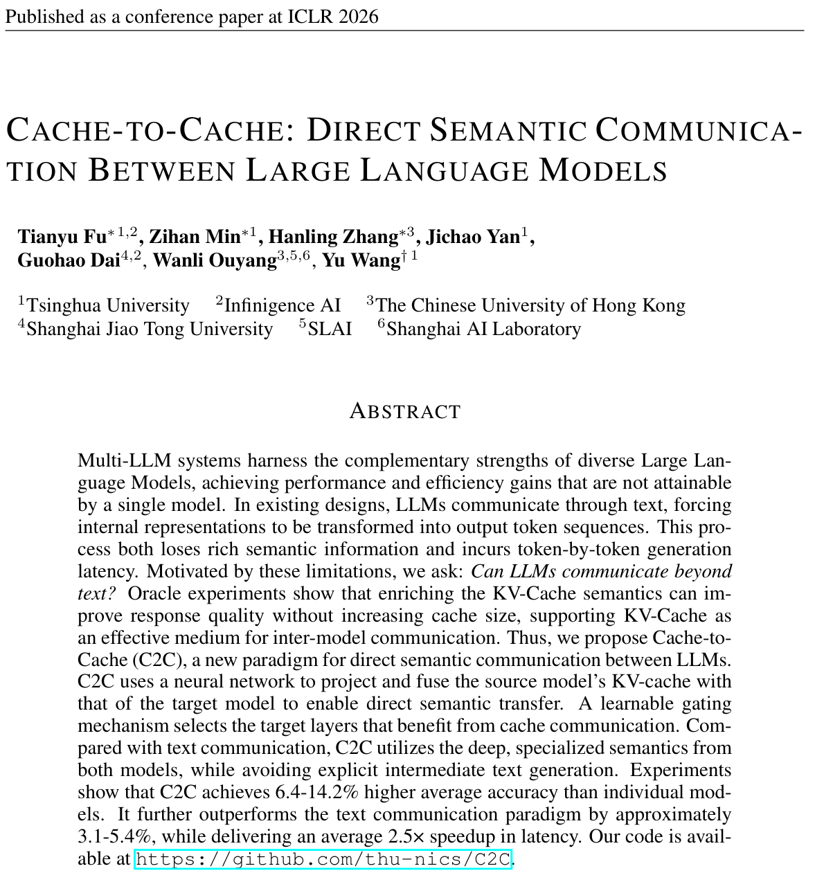
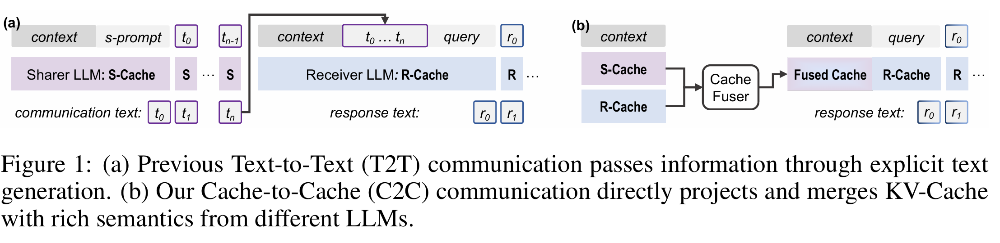
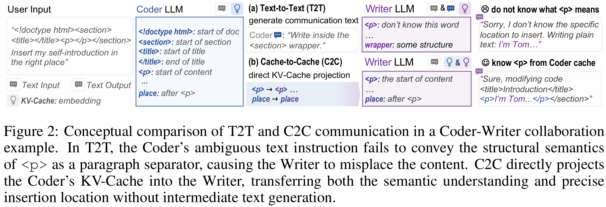
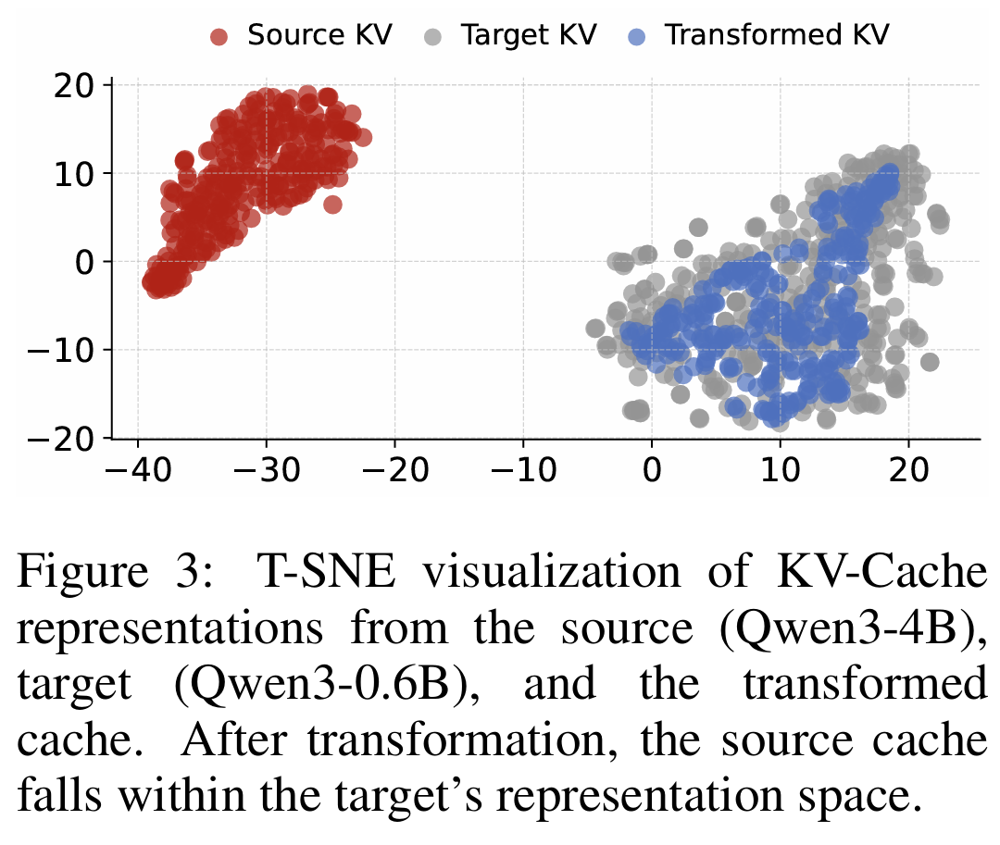
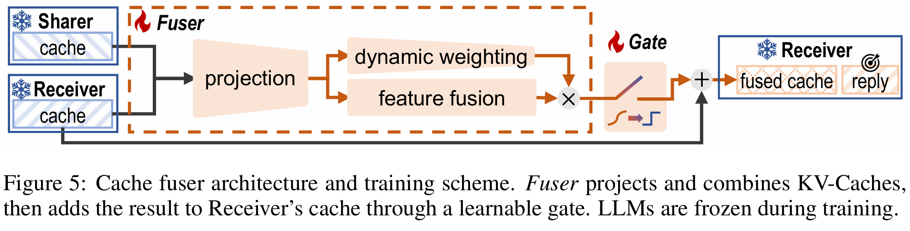
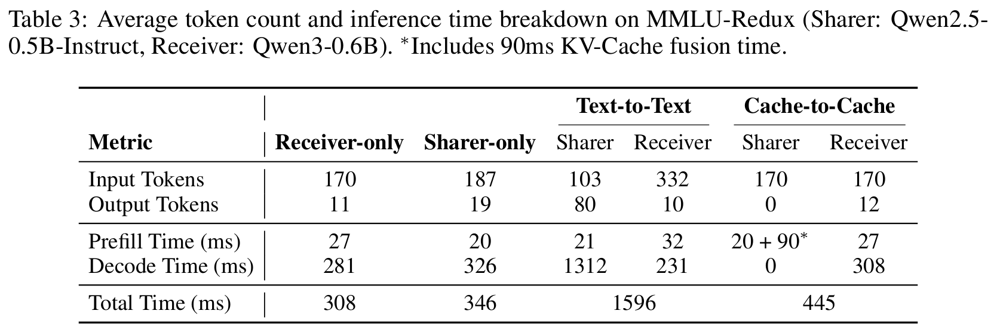
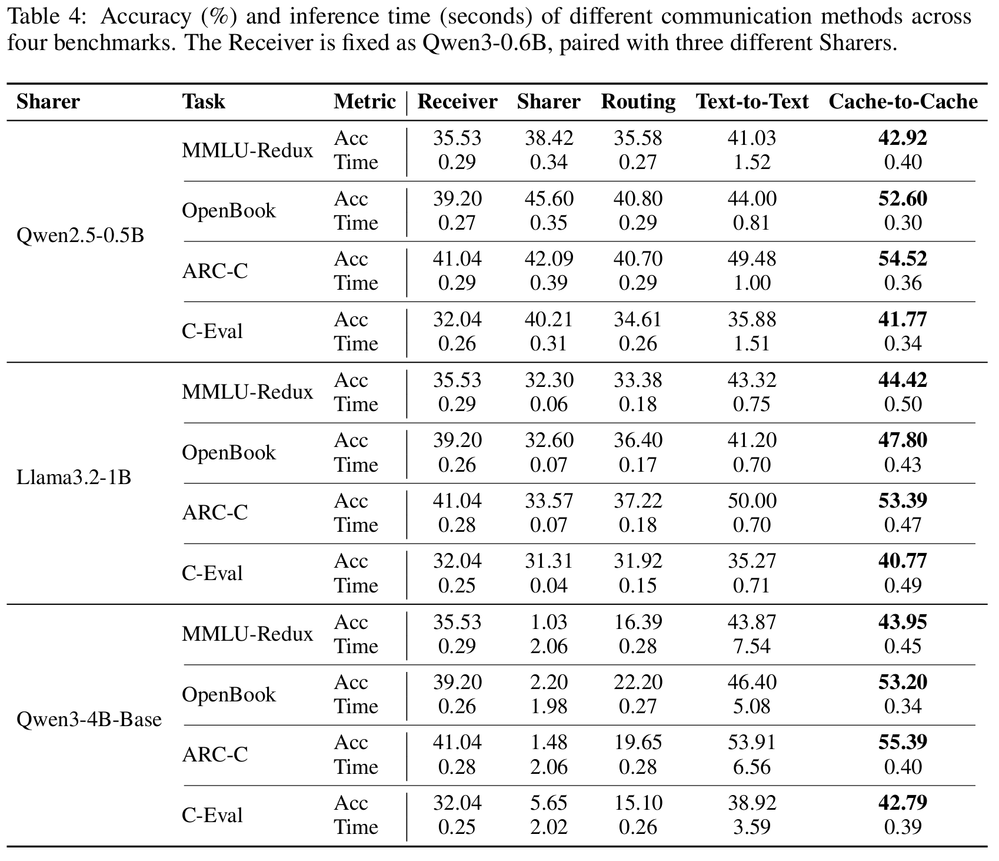
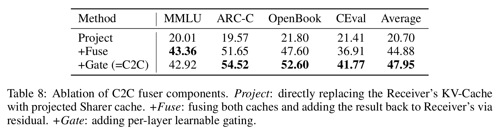

## 1. 论文解决的问题是什么？


当前多 LLM 协作一般是 **Text-to-Text communication**，也就是一个模型先生成一段文字，另一个模型再把这段文字读进去。

论文认为这种方式有三个问题：

第一，文本是低带宽媒介。模型内部高维语义表示被压缩成线性 token 序列，会损失很多隐含语义信息。

第二，自然语言有歧义。一个模型生成的解释，另一个模型未必能完整理解。

第三，文本通信慢。因为发送端模型必须 token-by-token 解码出中间通信文本，接收端再重新 prefill 这些文本，延迟较大。论文图 2 用 Coder-Writer 的例子说明：Coder 知道 `<p>` 是段落插入位置，但如果只通过模糊文本说明，Writer 可能无法准确理解；C2C 则直接传递 Coder 的 KV-cache 表示。 

所以它提出的问题是：

**LLM 之间能不能不通过文本，而是直接通过 KV-cache 这种内部表示进行语义通信？**

---

## 2. 输入、输出和中间传输的信息是什么？

这篇论文定义了两个角色：

**Sharer LLM**：提供知识、上下文理解或专门能力的模型。

**Receiver LLM**：接收 Sharer 的语义信息，并最终生成回答的模型。

系统输入是同一个上下文或问题 X。

Sharer 对 X 做 prefill，得到自己的 KV-cache：$C^S(X)$


Receiver 也对 X 做 prefill，得到自己的 KV-cache：$C^R(X)$

然后 C2C 模块把 Sharer 的 cache 投影到 Receiver 的表示空间，并和 Receiver 自己的 cache 融合，得到 fused cache：$C^F(X)$

最后 Receiver 不再只基于自己的 $C^R(X)$解码，而是基于融合后的 $C^F(X)$ 解码生成最终回答。

信息流可以写成：

```text
输入问题 / 上下文 X
        ↓
Sharer LLM prefill → Sharer KV-cache
        ↓
C2C fuser：投影、对齐、融合
        ↑
Receiver LLM prefill → Receiver KV-cache
        ↓
Fused Receiver KV-cache
        ↓
Receiver decode
        ↓
最终回答
```

这里传输的 latent information 是 **KV-cache**，不是 hidden states，也不是自然语言文本。

---

## 3. 它是不是真的“不需要接收端原始输入”？

这一点要特别注意。

**不是。**

C2C 不是“发送端只传 KV-cache，接收端完全不需要原始文本”的方案。根据论文方法部分，C2C 的 fuser 同时需要 Receiver 自己的 $C^R(X)$ 和 Sharer 的 $C^S_{G(n)}(X)$。也就是说，Receiver 仍然要对同一个输入上下文 $X$ 做 prefill，得到自己的 Receiver cache，然后再和 Sharer cache 融合。 

所以它的机制更准确地说是：

**Receiver 已经看到了原始上下文，但通过 Sharer 的 KV-cache 获得额外语义增强。**

---

## 4. 它如何实现异构模型表示空间对接？

这篇论文的核心是 **训练一个 neural cache fuser**。

论文先做了一个 oracle 实验：用 3 层 MLP 把 Qwen3-4B 的 KV-cache 映射到 Qwen3-0.6B 的空间。T-SNE 结果显示，原始 source cache 和 target cache 分布相距较远，但经过转换后，source cache 会落入 target model 的表示空间中。作者用这个实验说明：不同模型的 KV-cache 虽然空间不同，但具有一定可转换性。 

正式方法中，它不是只做简单 projector，而是设计了 **Cache Fuser**。这个模块包含三部分：

第一，**Projection module**：把 Receiver KV-cache 和 Sharer KV-cache 拼接，然后经过投影层和特征融合层。

第二，**Dynamic weighting module**：做输入相关的动态权重调整，相当于让模型判断当前输入下哪些信息更重要。

第三，**Learnable gate**：每层有一个可学习门控，用来判断这一层是否应该注入 Sharer 的 cache 信息。训练时用 Gumbel-sigmoid，推理时趋向二值化。 

**Projection module：**
解决“Sharer cache 和 Receiver cache 不是同一个空间”的问题。

**Dynamic weighting module：**
解决“当前输入下，Sharer 的哪些 head / 特征值得用”的问题。

**Learnable gate：**
解决“哪些 Receiver 层适合接收 Sharer 信息”的问题。
所以 C2C 的异构对齐过程可以理解为：

```text
Receiver KV-cache
Sharer KV-cache
        ↓
拼接
        ↓
线性层 / MLP 投影
        ↓
得到一份候选注入信息 ΔC
        ↓
dynamic weighting 给不同 head / 特征维度分配权重
        ↓
gate 决定这一层整体是否注入
        ↓
加到 Receiver cache 上
```
$\Delta C_n = \text{Projector}([C_n^R, C_{G(n)}^S])$
$W_n(X) = \text{DynamicWeight}([C_n^R, C_{G(n)}^S])$
$C_n^F = C_n^R + g_n \cdot W_n(X) \cdot \Delta C_n$

---

## 5. token 和 layer 如何对齐？

异构模型通信有两个实际问题：

第一，tokenizer 不同。

第二，模型层数不同。

论文分别做了 **token alignment** 和 **layer alignment**。

token alignment 的做法是：把 Receiver 的 token 先 decode 成字符串，再用 Sharer 的 tokenizer 重新编码。如果出现一个 Receiver token 对应多个 Sharer token 的情况，就选择字符串覆盖度最大的 Sharer token，以尽量保留语义信息。 

layer alignment 的做法是 **terminal alignment**，也就是从最后一层开始对齐：Receiver 最后一层对 Sharer 最后一层，倒数第二层对倒数第二层，以此类推，直到较浅模型的第一层。作者选择这种方式，是因为深层通常包含更高层语义信息。 

这部分说明了异构模型 KV-cache 通信不是简单地：

```text
source KV → projector → target KV
```

而是还要处理：

```text
tokenizer 对齐
layer 对齐
hidden size / KV 维度对齐
注入层选择
```

---

## 6. 训练方式是什么？

训练时，**Sharer 和 Receiver 两个大模型都冻结**，只训练 C2C 模块，也就是 projector / fuser / gate 这些小模块。论文明确说采用类似 SFT 的标准 next-token prediction loss，让 Receiver 在 fused cache 条件下预测 response。训练流程是：两个模型先分别编码输入得到 KV-cache，然后 C2C 融合 cache 并替换 Receiver cache，最后通过 Receiver 的响应预测损失把梯度回传到 C2C 模块。 

所以它不是全参训练大模型，也不是 LoRA 微调大模型，而是：

```text
输入上下文 X
        ↓
Sharer LLM 前向传播，得到 Sharer KV-cache
        ↓
Receiver LLM 前向传播，得到 Receiver KV-cache
        ↓
C2C fuser 融合两边 cache
        ↓
Receiver 使用 fused cache 预测标准答案 response
        ↓
计算 next-token loss
        ↓
冻结两个大模型，只更新 C2C fuser 的参数
```

论文主体更接近“任务监督下的 cache fusion 学习”, 用的是 **生成任务损失驱动的行为对齐**

---

## 7. 实验结果说明了什么？

实验覆盖了不同模型家族、不同模型大小和不同任务，包括 Qwen2.5、Qwen3、Llama3.2、Gemma3；任务包括 OpenBookQA、MMLU-Redux、ARC-Challenge、C-Eval。训练数据使用 OpenHermes2.5 的前 500k 样本，评估使用 zero-shot，推理时间在单张 A100、batch size 1 下测量。 


核心结果可以这样看：

第一，C2C 的准确率通常高于 Receiver-only、Sharer-only、Routing 和 Text-to-Text。

例如 Table 4 中，Receiver 固定为 Qwen3-0.6B 时，搭配 Qwen2.5-0.5B、Llama3.2-1B、Qwen3-4B-Base 三类 Sharer，C2C 在 MMLU-Redux、OpenBook、ARC-C、C-Eval 上基本都超过 T2T。 

第二，C2C 比 Text-to-Text 快。

论文 Table 3 显示，在 MMLU-Redux 示例中，T2T 需要 Sharer 生成 80 个通信 token，Sharer decode 时间达到 1312 ms；而 C2C 不生成中间文本，用约 90 ms 的 KV-cache fusion 替代这部分顺序解码。 

第三，C2C 的收益不是简单来自参数增加。

Table 6 / Table 8 的消融说明，如果只做 projection 并替换 Receiver cache，效果很差；必须融合 Receiver 和 Sharer 的 cache，并保留 Receiver cache 的残差信息。加入 gate 后，平均准确率进一步提升。论文中 Project 的平均准确率只有 20.70，+Fuse 达到 44.88，+Gate 即完整 C2C 达到 47.95。 

这说明 C2C 的关键不是“把 Sharer cache 硬塞给 Receiver”，而是：

**保留 Receiver 自身理解，同时选择性注入 Sharer 的补充语义。**

---

## 8. 论文的核心贡献是什么？

第一，它把 KV-cache 从“推理加速缓存”提升为“模型间语义通信媒介”。这点和传统 KV-cache reuse 论文明显不同。

第二，它验证了异构模型之间 KV-cache 具有可转换性。不同模型 KV-cache 空间不一致，但可以通过 MLP / fuser 映射到目标模型空间。

第三，它提出了带 projection、dynamic weighting 和 learnable gate 的 cache fuser，使 Receiver 能吸收 Sharer 的语义信息。

第四，它证明 C2C 相比 Text-to-Text 不仅更快，而且在多个任务上准确率更高。

---

## 9. 这篇论文的局限性

第一，C2C 仍然需要 Sharer 和 Receiver 都对输入上下文做 prefill。它省掉的是 Sharer 生成中间通信文本的过程，而不是完全省掉接收端的输入理解。

第二，它主要是 pairwise communication。论文也承认，多模型规模扩展仍然是问题。如果有 (N) 个模型，两两训练 fuser 会带来较大训练成本；附录中提出通过统一 latent space 把复杂度从 (O(N^2)) 降低到 (O(N))，但这仍属于初步探索。 

第三，如果 Sharer 很弱，或者 Sharer 的上下文理解错误，它可能会误导 Receiver。论文也指出 C2C 和 T2T 都有这个问题，只是通信媒介不同。 

第四，它没有真正研究通信信道问题。比如带宽约束、量化误差、噪声扰动、Rayleigh / AWGN 信道、传输错误对 KV-cache 语义的影响，这些都不是本文重点。

---
