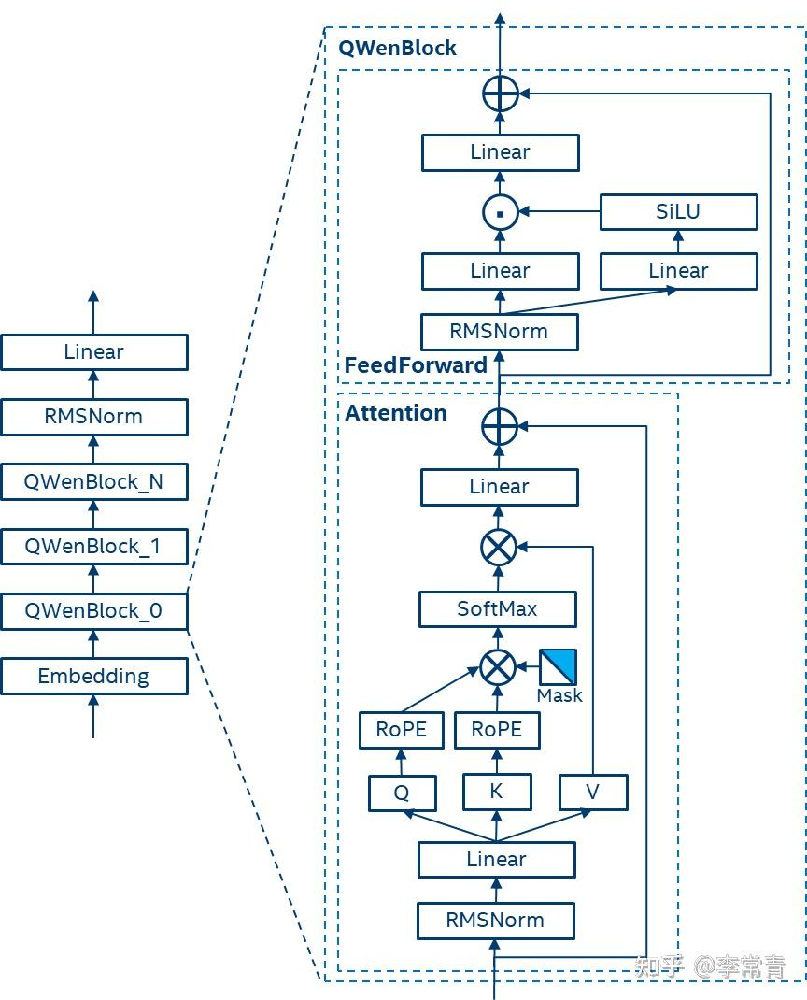

## 1. 现代大语言模型Qwen/LLaMA架构中的 hidden state 

Qwen 类模型通常采用 decoder-only、Pre-Norm、RoPE 架构。

一个 Qwen Block 可概括为：

\[
x_l
\rightarrow \operatorname{RMSNorm}
\rightarrow \operatorname{Attention}
\rightarrow +x_l
\rightarrow \operatorname{RMSNorm}
\rightarrow \operatorname{MLP}
\rightarrow +\text{residual}
\rightarrow x_{l+1}
\]

\[
\boxed{x_{l+1}}
\]

即整个 Qwen Block 最上方残差加法后的输出，被视为该层的 block-level hidden state。

整个模型可以看成：

## 2. 一个模型的 Hidden State 能否直接给另一个模型

关键结论：

\[
\boxed{\text{Hidden State 不是天然通用的“跨模型语言”}}
\]

是否能直接工作取决于 Sender 和 Receiver 的表示接口是否兼容。

| Sender → Receiver | 是否可能直接工作 | 原因 |
|---|---:|---|
| 同一模型，第 \(l\) 层 → 第 \(l+1\) 层 | 可以 | 本来就是模型正常 forward 的接口 |
| 同一模型，最后层 → 第一层 | 通常不合理 | layer-space mismatch |
| 不同模型，同层 → 同层 | 通常不可靠 | latent coordinate system 不一致 |
| 不同模型 + adapter | 更合理 | 学习 A→B 的表示映射 |

需要区分三种兼容性：

\[
\boxed{
\text{shape compatible}
\neq
\text{distribution compatible}
\neq
\text{functionally compatible}
}
\]

即使两个模型都有：

\[
h_A,h_B\in\mathbb R^{4096}
\]

也只说明 shape 一样，并不说明两个表示空间等价。

---

## 3. PD 分离中为什么主要传 KV Cache

在 Prefill–Decode Disaggregation 中，Prefill 节点处理 prompt 并构造各层 KV Cache：

\[
\{K_l,V_l\}_{l=1}^{L}
\]

然后 Decode 节点继续逐 token 生成。

原因是生成第 \(T+1\) 个 token 时，每层 Attention 都需要历史 token 的：

\[
K_{1:T}^{(l)},V_{1:T}^{(l)}
\]

因此：

\[
\boxed{\text{KV Cache 是标准 autoregressive decoding 所需的计算状态}}
\]

而普通最后层 hidden state：

\[
H^{(L)}
\]

无法直接替代所有层的历史 KV。

---

## 4. 为什么只传最后一层 Hidden State 不能直接持续 Decode

如果电脑 A 拿到：

\[
h_T^{(L)}
\]

电脑 B 可以用 LM Head 算出一次 next-token logits：

\[
\text{logits}_{T+1}
=
W_{\text{LM}}\operatorname{Norm}(h_T^{(L)})
\]

因此：

\[
h_T^{(L)}
\rightarrow
\text{LM Head}
\rightarrow
x_{T+1}
\]

这一小步可以。

但生成下一个 token 后，B 的第 1 层 Attention 就需要：

\[
K_{1:T}^{(1)},V_{1:T}^{(1)}
\]

后续每层也需要对应 KV。

仅有：

\[
h_T^{(L)}
\]

无法恢复：

\[
\{K_l,V_l\}_{l=1}^{L}
\]

因此：

\[
\boxed{
\text{Last Hidden State}
\neq
\text{完整 Decoding State}
}
\]

所以：

- 标准 PD 分离：传 KV Cache；
- Pipeline Parallel：常传 hidden activation；
- Agent latent communication：可传 hidden-derived latent。