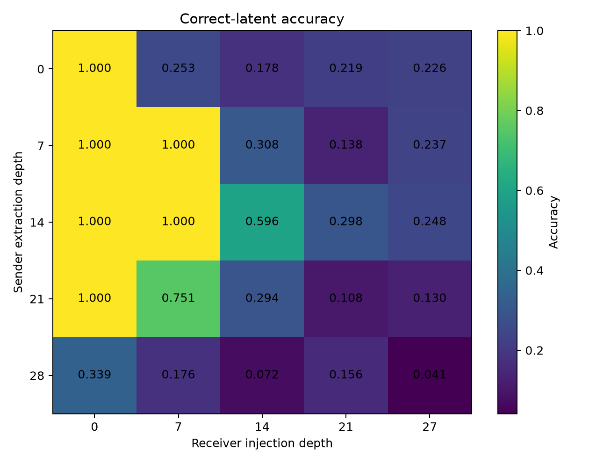
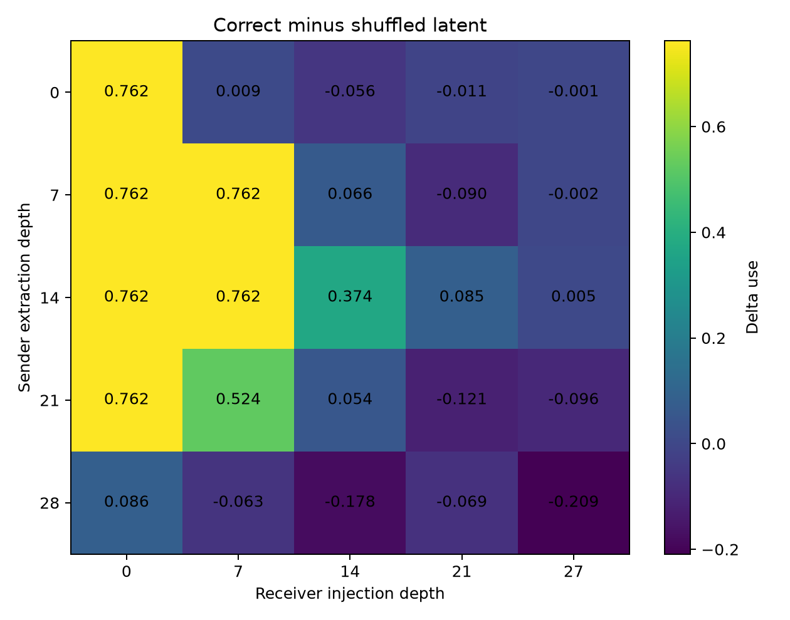
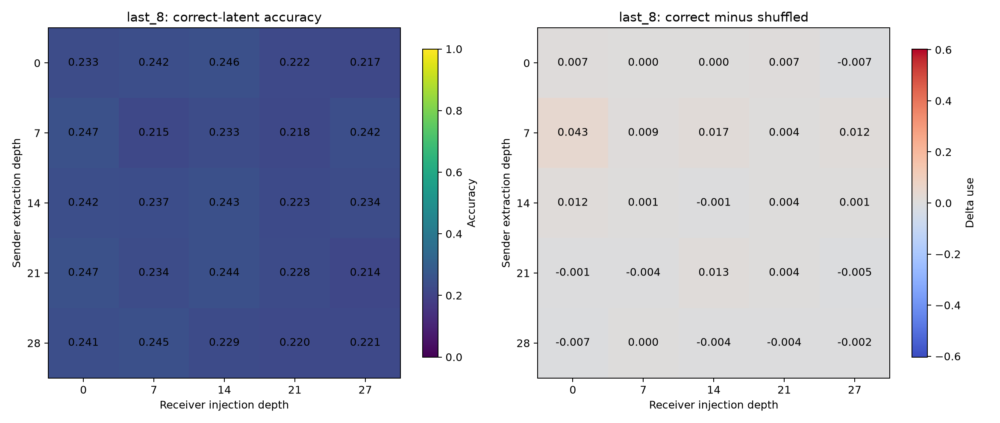
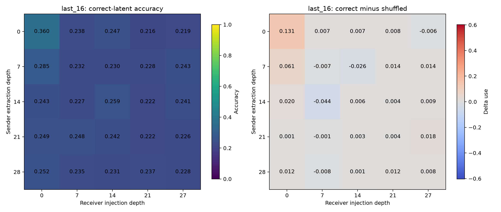
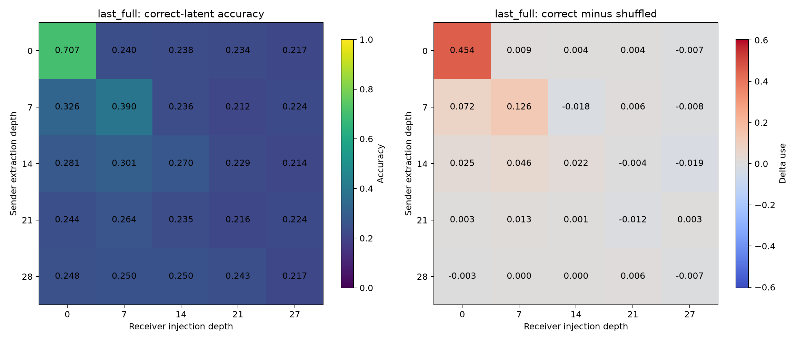
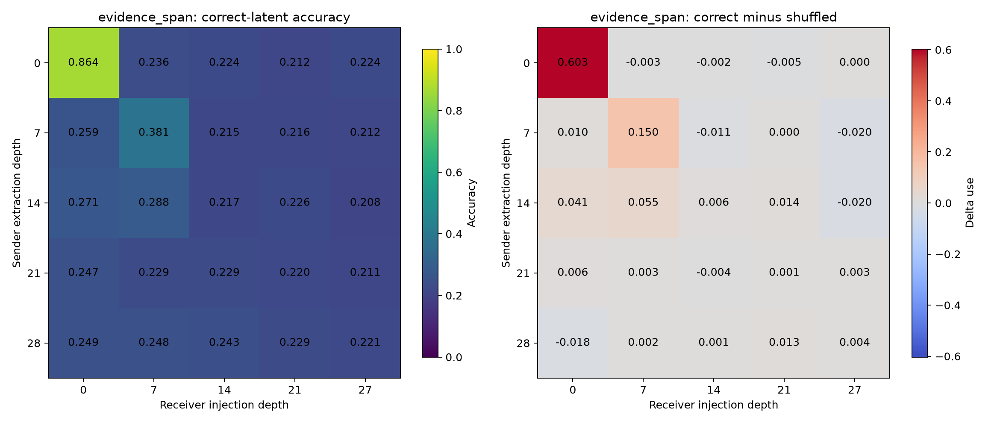
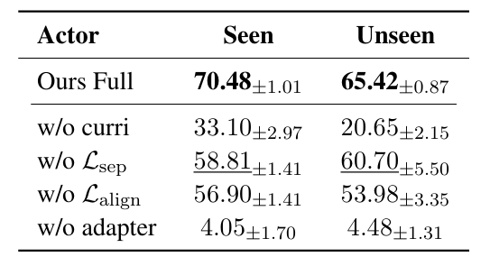

## 1. 主要实验结果
### 实验设置
- 模型选择：QWEN2.5-1.5B instruct
- Sender depths: `0, 7, 14, 21, 28`
- Receiver depths: `0, 7, 14, 21, 27`
- Hidden size: `1536`
- Latent variants: last `8`, `16`, `32`, `full`, and `evidence_span`
- samples: `1000`
```text
QA任务示例：
Sender:
Private information:
Alice lives in Paris.
Bob lives in London.
Carol lives in Tokyo.
David lives in Rome.

Question:
Where does Carol live?

Receiver:
Question:
Where does Carol live?

A. Paris
B. London
C. Tokyo
D. Rome

Answer:

插入规则：
[Receiver question and options][Sender latent][\n\nAnswer:]
```
### 直接给出答案的 baseline(The correct answer is C)：
 
 
### 正式实验
 
 
 



**实验效果好的几个点:**

| Latent | Sender→Receiver | Accuracy | Delta use | Correct−Zero |
|---|---:|---:|---:|---:|
| evidence | 0→0 | **0.864** | **0.603** | 0.615 |
| full | 0→0 | 0.707 | 0.454 | 0.459 |
| last-32 | 0→0 | 0.695 | 0.434 | 0.446 |
| last-16 | 0→0 | 0.360 | 0.131 | 0.111 |
| evidence | 7→7 | **0.381** | **0.150** | 0.143 |
| last-32 | 7→7 | **0.405** | **0.139** | 0.184 |
| full | 7→7 | 0.390 | 0.126 | 0.168 |
| last-32 | 14→7 | 0.319 | 0.065 | 0.098 |

这里 `correct−zero` 与 `delta_use` 方向一致，说明强结果不是单纯增加 latent token 或改变 position 引起的。

## 2. 长度提升本质上是 evidence coverage 提升

实际 private-context prompt 的 token 范围类似：

```text
last-8:
.
Question:
Where does Nina live?
```

```text
last-16:
...最后一到两条事实...
Question:
Where does Nina live?
```

```text
last-32:
几乎完整的四条事实 + Question
```

因此：

- `last-8` 没有答案事实，整个热力图接近 chance 是合理的。
- `last-16` 偶尔覆盖目标事实，所以只有有限提升。
- `last-32/full` 基本覆盖全部事实，因此明显提升。
- evidence-span 只用平均约 5.57 个 token，却达到最高的 86.4%。

所以这里不能简单得出“latent 越长越好”，更准确的结论是：

> latent 是否包含目标 evidence，比 latent token 数量更重要。

Evidence-span 是一个 oracle selector，结果证明“选择正确 token”比增加通信带宽更有效。

## 3. Depth 0 很强，但它接近文本注入

`sender=0, receiver=0` 时传递的是 token embedding。它基本等价于把对应文本作为连续 soft tokens 插入 Receiver，然后让它经过完整 28 层。

因此：

- evidence 0→0 的 86.4% 证明 evidence 提取和 Receiver prompt 都正确。
- 但它不能单独证明“深层 hidden-state communication”成立。

更有研究价值的是 `7→7`：

```text
evidence: accuracy 0.381, delta_use 0.150
last-32: accuracy 0.405, delta_use 0.139
full: accuracy 0.390, delta_use 0.126
```

这说明经过前 7 层的 contextual hidden states，确实还能被另一个 Receiver 的第 7 层继续利用。

## 4. 有效区域不是完整对角线，而是左上角

Private-context 中：

- Receiver depth 0 最强。
- Receiver depth 7 次强。
- Receiver depth ≥14 时，绝大多数 `delta_use` 接近 0。
- Sender depth 21/28 基本无法利用。

这说明决定性能的不只是“Sender 和 Receiver 层数匹配”，还有剩余计算量：

- Receiver depth 0：latent 后面还有 28 层。
- Receiver depth 7：还有 21层。
- Receiver depth 14：只剩14层。
- Receiver depth 21/27：只剩7层或1层。

Evidence 需要完成“恢复城市 → 匹配选项 → 输出标签”，剩余层数太少时无法完成。

因此这次结果更支持：

> Raw latent 需要足够多的下游 Transformer blocks 才能被解释，而不是只要 depth 相等就能直接兼容。

## 5. Baseline 结果说明 pipeline 正常

Baseline 的明显有效区域包括：

- 0→0：1.000
- 7→0、7→7：1.000
- 14→0、14→7：1.000
- 14→14：0.596，`delta_use=0.374`
- 21→0：1.000
- 21→7：0.751

这证明：

- 正确 latent 确实按 sample 注入。
- 固定 `Answer:` suffix 能读取 latent。
- shuffled mapping 工作正常。
- hidden state 中显式答案标签能够跨 forward 传递。

Baseline 呈现出近似三角形兼容区：通常 `receiver_depth ≤ sender_depth`，同时 Receiver 必须保留足够多的剩余层。

但后期出现很强的负 delta，例如：

- 21→21：`-0.121`
- 28→14：`-0.178`
- 28→27：`-0.209`

这不太像普通统计噪声，而更像晚层表示不兼容：正确答案对应的 late hidden state 被注入后，反而系统性推动了错误选项。

**《Enabling Agents to Communicate Entirely in Latent Space》的实验结果**


## 最终可以得出的结论
1. Hidden injection pipeline 已经通过 smoke 验证。
2. Private evidence 的使用具有明确因果性，因为 correct 显著高于 shuffled 和 zero。
3. Oracle evidence-span 是最有效率的通信方案。
4. 真正有意义的 intermediate transfer 出现在浅层，尤其是 7→7。
5. 中晚层没有表现不等于其中没有信息，只能说明未训练的 Receiver 无法直接利用这些 raw hidden states。
6. 下一步最值得研究的是 layer alignment、activation normalization 或轻量 adapter，而不是继续单纯增加 latent length。