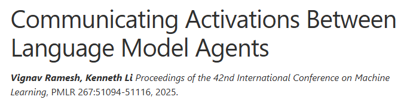
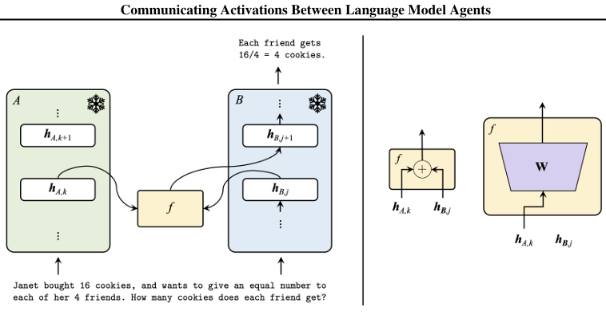
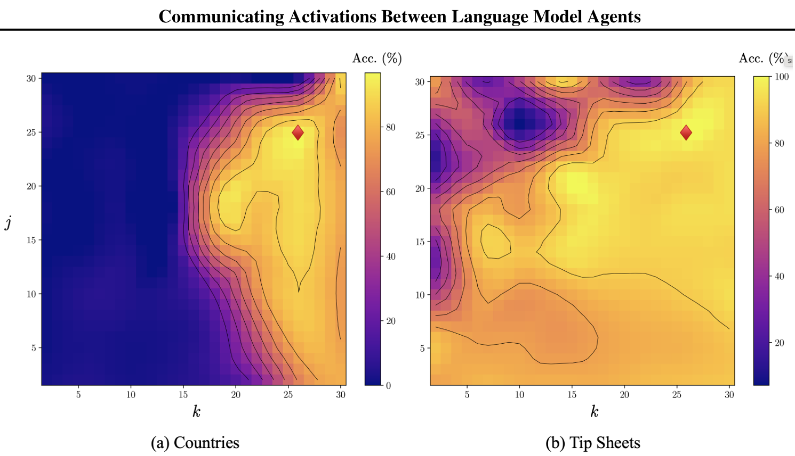
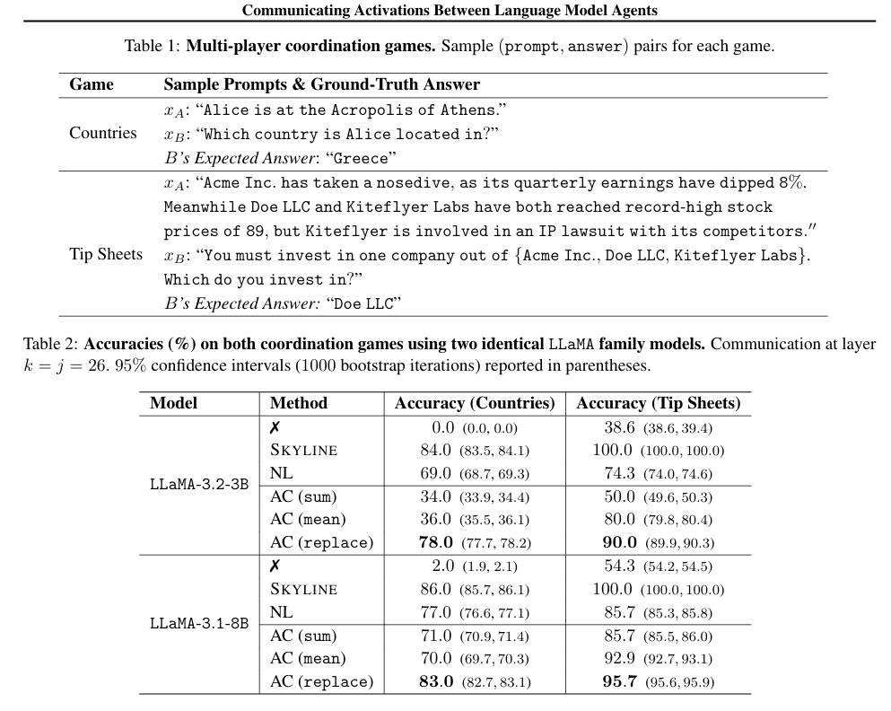
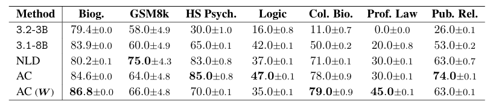
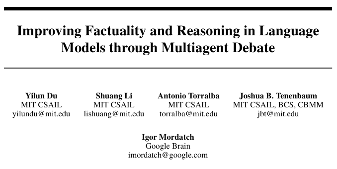
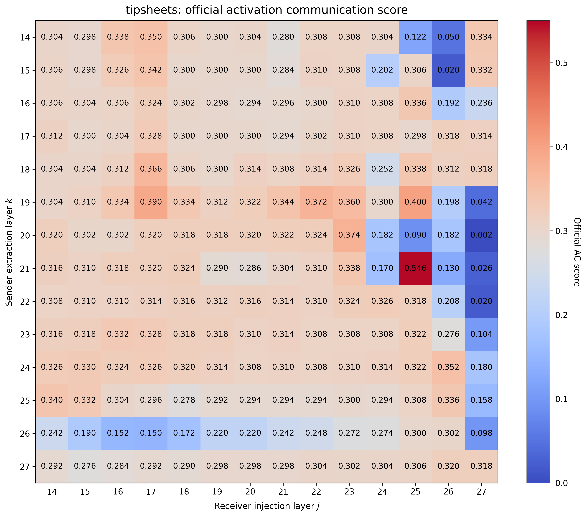
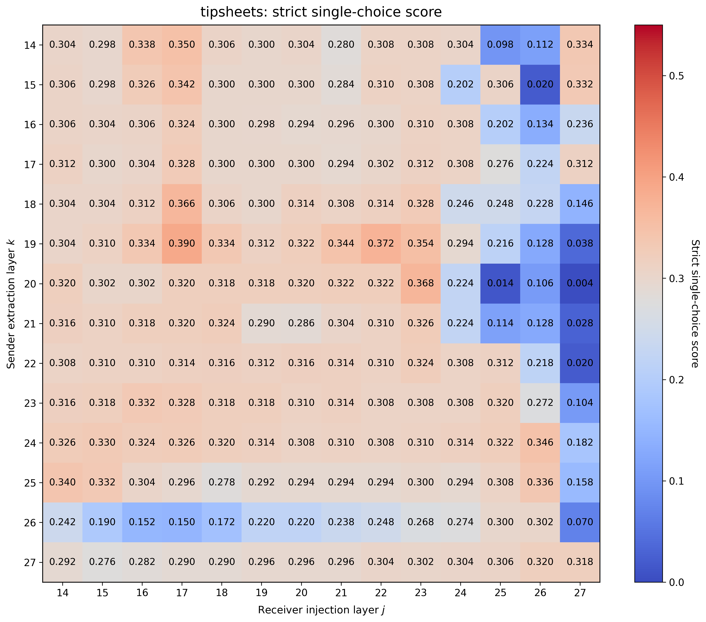

# 第一部分：论文方法

## 1. 研究动机

传统多智能体语言模型通常使用自然语言通信：

```text
Sender A → 生成文本消息 → tokenize → Receiver B → 生成答案
```

这种方式有两个问题：

1. **计算成本高：** sender 需要逐 token 解码消息，receiver 还要重新处理消息；
2. **信息压缩：** 模型内部原本具有高维连续表示，但经过 LM Head 和离散 token 解码后，可能丢失一部分语义信息。

论文因此提出直接通过中间层 activation 通信，让 sender 不必先生成自然语言消息。

## 2. Activation Communication 的基本流程

设：

- $A$：sender 模型；
- $B$：receiver 模型；
- $k$：sender activation 提取层；
- $j$：receiver activation 注入层。

首先分别运行两个模型：

$$
h_{A,k}=A_{\leq k}(x_A), \qquad h_{B,j}=B_{\leq j}(x_B)
$$

论文只使用两个序列**最后一个 token**的 activation：

$$
a=(h_{A,k})_{\mathrm{last}}, \qquad b=(h_{B,j})_{\mathrm{last}}
$$

然后用函数 $f$ 融合两者：

$$
b'=f(a,b)
$$

将 receiver 最后一个 token 的 activation 替换为 $b'$，再让 $B$ 从后续层继续前向传播并生成答案：

```text
x_A → A 前向到第 k 层 → sender 最后 token activation a
                                             ↓
x_B → B 前向到第 j 层 → receiver activation b → f(a,b) → B 后续层 → 答案
```

该方法不增加序列长度，不传输 KV cache，也不是将 activation 作为额外 token 拼接到输入中，而是直接修改 receiver residual stream 中已有位置的向量。

## 3. Activation 融合方式


论文主要比较三种无需训练的融合函数：

$$
\begin{aligned}
\text{sum: } & f(a,b)=a+b \\
\text{mean: } & f(a,b)=\frac{a+b}{2} \\
\text{replace: } & f(a,b)=a
\end{aligned}
$$

其中 replace 最简单：

$$
(h_{B,j})_{\mathrm{last}} \leftarrow (h_{A,k})_{\mathrm{last}}
$$

论文实验发现 replace 通常优于 sum 和 mean。一个可能原因是 sum 会显著改变 activation 的范数和分布，而 replace 至少注入的是另一个真实模型产生的 activation。本周实验因此统一使用 `f=replace`。

如果两个模型的 activation 空间差异较大，论文还提出学习任务无关的线性映射矩阵 $W$：

$$
a' = Wa
$$

再将 $a'$ 注入 receiver。Vanilla AC 不需要额外训练；$W$ 则是 model-pair-specific、task-agnostic 的可选模块。

**原论文实验结果**



---

# 第二部分：本周实验

## 实验设置

| 项目 | 设置 |
|---|---|
| Sender model | Qwen2.5-1.5B-Instruct |
| Receiver model | Qwen2.5-1.5B-Instruct |
| 数据集 | TipSheets |
| 测试样本数 | 500 |
| 通信函数 | `replace` |
| 解码方式 | greedy，`do_sample=False` |
| Sender 层范围 | $k=14,\ldots,27$ |
| Receiver 层范围 | $j=14,\ldots,27$ |
| 网格规模 | $14\times14=196$ 个组合 |

TipSheets 的 sender 接收公司相关 tip sheet，receiver 只看到投资选择问题，需要依赖通信获得 private context。

### 指标说明

本周同时报告两种指标：

1. **开源仓库指标：** 使用当前仓库的 token F1-match，F1 大于 0.5 即判为正确；
2. **严格单选指标：** 回复中必须只出现一个完整候选项，并且该候选项等于标准答案；包含多个候选项一律判错。


## 基线实验

| 方法 | 分数 |
|---|---:|
| Silent / no communication | 0.298 |
| Skyline（单模型同时看到两侧信息） | 0.514 |
| Natural Language Communication | 0.452 |

基线含义：

- **Silent** 表示 receiver 不接收 sender 信息，是效果下界；
- **Skyline** 将完整信息直接提供给单个模型，是当前设置下的参考上界；
- **NLD(Duetal., 2023)** 表示 sender 先生成自然语言消息，再交给 receiver。


## 14×14 宽松F1指标热力图



主要现象：
- 全部 196 个格点均完成；
- 平均值为 0.288，中位数为 0.307；
- 最大值出现在 `21→25`，官方分数为 0.546；
- `j=25–27` 区域出现较强的不稳定性，部分组合异常升高，部分组合接近完全失效；
- 对角线 $k=j$ 平均约为 0.310，整体稳定但提升有限。

仅观察宽松F1指标时，`21→25=0.546` 甚至超过 skyline 0.514。但后续逐样本分析发现，这一高分主要来自模型同时输出多个候选项，被宽松 F1-match 误判为正确，因此不能解释为有效单选通信。

## 14×14 严格单选热力图



严格指标统计：

| 统计量 | F1指标 | 严格单选指标 |
|---|---:|---:|
| 平均值 | 0.288 | 0.281 |
| 中位数 | 0.307 | 0.305 |
| 最大值 | 0.546 | 0.390 |
| 官方/严格完全一致的格点 | 151/196 | 151/196 |


### 主要异常点

| $k\to j$ | F1指标 | 严格指标 | 差值 |
|---|---:|---:|---:|
| 21→25 | 0.546 | 0.114 | 0.432 |
| 19→25 | 0.400 | 0.216 | 0.184 |
| 18→27 | 0.318 | 0.146 | 0.172 |
| 16→25 | 0.336 | 0.202 | 0.134 |

其中 `21→25` 的 correct 和 shuffled 都容易枚举多个候选公司，因此官方高分不是正确样本 activation 所带来的语义增益。

### 严格指标最佳候选层组合

| 排名 | $k\to j$ | F1指标 | 严格指标 | 相对 silent |
|---:|---|---:|---:|---:|
| 1 | **19→17** | **0.390** | **0.390** | +0.092 |
| 2 | 19→22 | 0.372 | 0.372 | +0.074 |
| 3 | 20→23 | 0.374 | 0.368 | +0.070 |
| 4 | 18→17 | 0.366 | 0.366 | +0.068 |
| 5 | 19→23 | 0.360 | 0.354 | +0.056 |

从列均值看，`j=17、22、23` 是较稳定的 receiver 注入位置；`j=25–27` 整体更容易出现格式异常或性能崩塌。从行分布看，`k=19` 形成了最明显的局部高分带。

## 与基线的综合比较

| 方法 | 严格/可解释分数 | 相对 silent |
|---|---:|---:|
| Silent | 0.298 | — |
| Self control（官方AC路径） | 0.306 | +0.008 |
| Shuffled activation | 0.324 | +0.026 |
| **Correct AC，19→17** | **0.390** | **+0.092** |
| Natural Language Communication | 0.452 | +0.154 |
| Skyline | 0.514 | +0.216 |

当前 AC 尚未超过 NLD 和 skyline，但已经将 silent 的 0.298 提升至严格单选 0.390，绝对提升 9.2 个百分点。更重要的是，correct 显著优于 shuffled 与 self，说明提升具有样本相关性。

