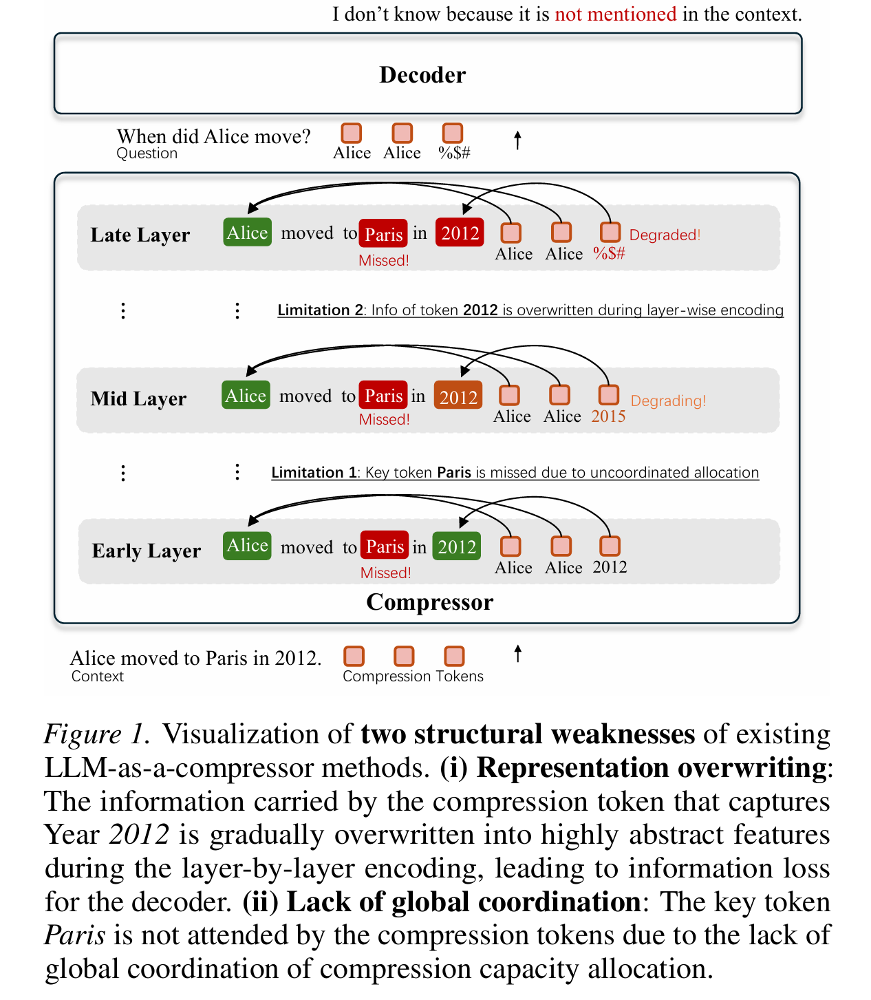
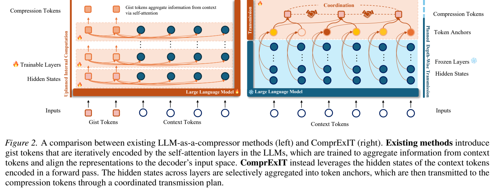
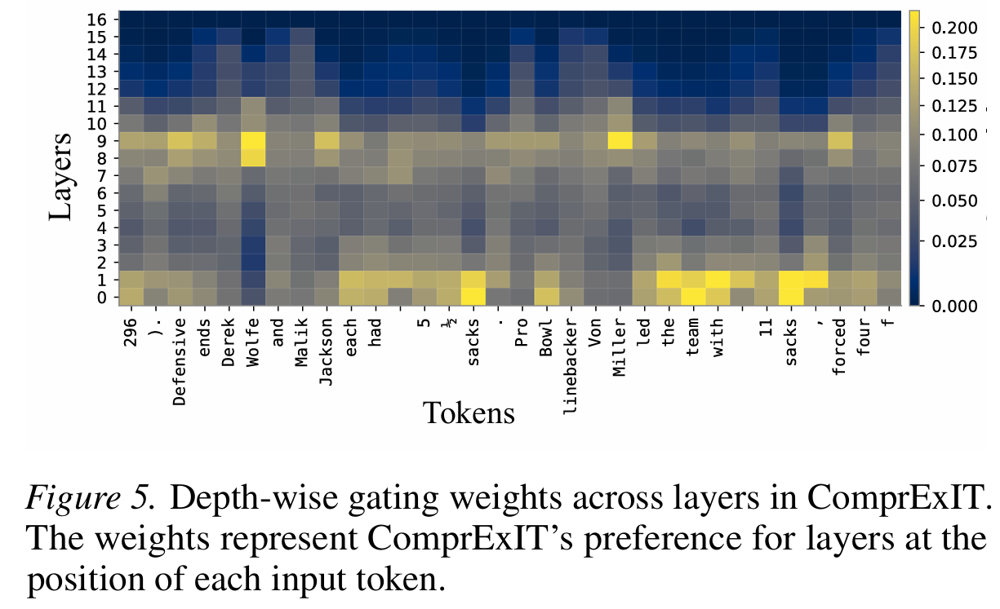
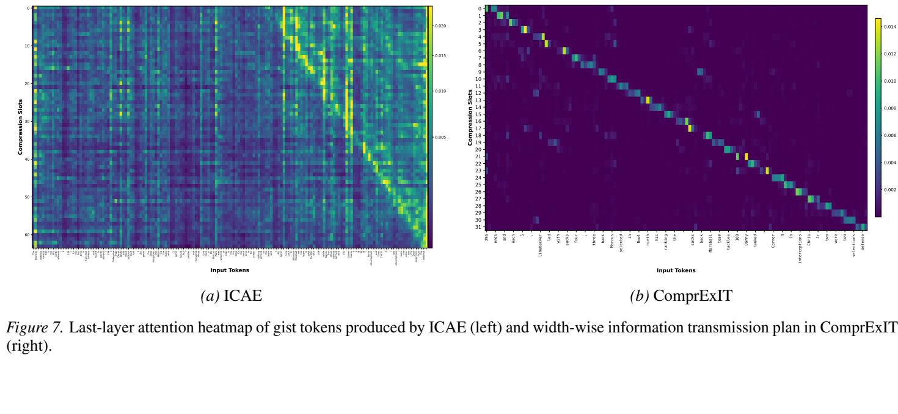
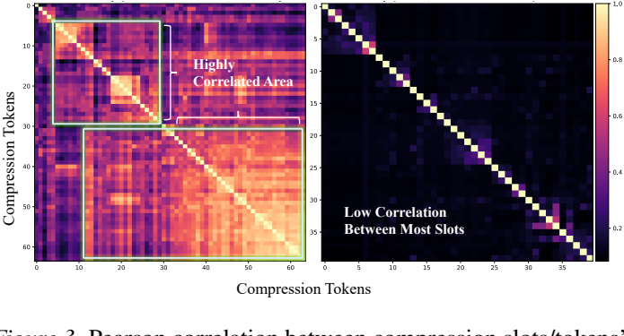
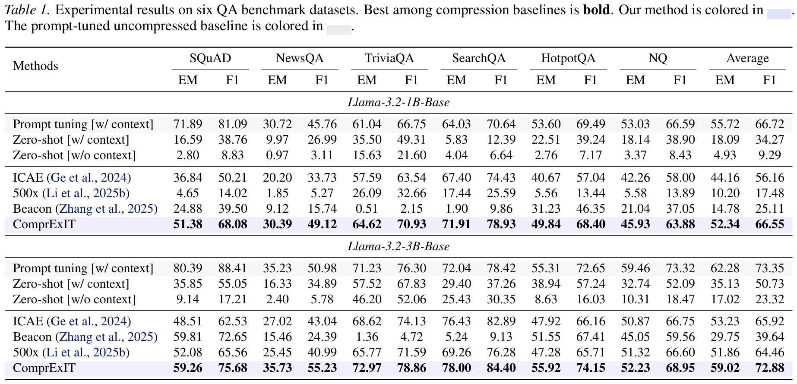
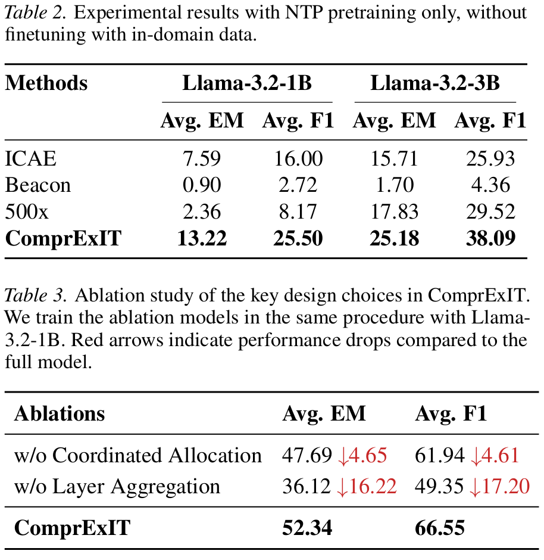

# 论文汇报：Context Compression via Explicit Information Transmission

## 1. 这篇论文主要在做什么

这篇论文提出了一种新的软上下文压缩方法 **ComprExIT**。它的目标是将原始长上下文中的 \(N\) 个 token 压缩成 \(K\) 个连续向量形式的 compression slots，其中 \(K \ll N\)，然后把这些压缩向量作为压缩后的上下文提供给 decoder 使用。

与传统方法不同，ComprExIT **不把 LLM 本身训练成 compressor**。传统 LLM-as-a-compressor 方法通常引入 gist tokens / memory tokens，让这些压缩 token 在 Transformer 内部通过 self-attention 一层层吸收上下文信息。论文认为这种方式存在表示覆盖、层间分布漂移和压缩容量分配不协调的问题。

ComprExIT 的核心思路是：

\[
\text{冻结 LLM} \rightarrow \text{提取多层 hidden states} \rightarrow \text{显式信息传输} \rightarrow \text{生成 compression slots}
\]

也就是说，LLM 本体主要作为一个 frozen feature extractor，真正训练的是一个轻量压缩模块。

## 2. 输入和输出是什么

设输入上下文为：

\[
x = (x_1, x_2, \dots, x_N)
\]

冻结的 LLM 有 \(L\) 层，每一层都会产生上下文 token 的 hidden states：

\[
H^{(\ell)} \in \mathbb{R}^{N \times d}, \quad \ell = 1, \dots, L
\]

其中 \(h_t^{(\ell)}\) 表示第 \(t\) 个 token 在第 \(\ell\) 层的 hidden representation。

压缩目标是从 \(N\) 个 token 得到 \(K\) 个 compression slots：

\[
C = (c_1, c_2, \dots, c_K), \quad C \in \mathbb{R}^{K \times d}
\]

其中：

- \(N\)：原始上下文长度；
- \(K\)：压缩后的 slot 数量；
- \(K \ll N\)；
- \(d\)：decoder 可接受的 hidden dimension。

在问答任务中，最终输入 decoder 的形式可以理解为：

\[
[C, q]
\]

其中 \(C\) 是压缩后的上下文表示，\(q\) 是问题 token。论文是question-unaware compression，decoder根据压缩上下文和问题生成答案。

## 3. 解决了什么问题

论文主要针对长上下文推理中的两个问题。

第一，长上下文推理成本高。Transformer attention 的计算和 KV cache 成本都会随上下文长度增长。上下文越长，推理越贵，部署越困难。

第二，现有软压缩方法存在结构性缺陷。传统 LLM-as-a-compressor 方法依赖压缩 token 在 LLM 内部通过 self-attention 逐层吸收上下文信息，但这种方式有两个 challenge。

### Challenge I: Layer-wise Distribution Mismatch

传统方法中，compression tokens 会在 Transformer 每一层不断更新：

\[
Z^{(\ell+1)} = \text{Attn}(Z^{(\ell)}, H^{(\ell)})
\]

问题是，压缩 token 的表示在层与层之间不断漂移。早期层吸收的细节信息可能在后续层被覆盖，最后一层表示又往往更偏向生成下一个 token 的抽象语义，而不一定适合保留原始上下文细节。

因此，最终压缩表示 \(Z^{(L)}\) 可能与 decoder 期望的输入表示分布不一致。论文将这个问题称为 **layer-wise distribution mismatch**。

直观例子：上下文中有 “Alice moved to Paris in 2012.”，早期或中间层可能保留了 “Paris” 和 “2012” 这些具体信息，但经过多层更新后，这些细节可能被更抽象的表示覆盖。

### Challenge II: Lack of Global Allocation

传统 self-attention 中，每个 compression token 通常独立决定自己 attend 哪些上下文 token：

\[
z_k^{(\ell+1)}
= \sum_t \alpha_{k,t}^{(\ell)} h_t^{(\ell)}
\]

这会导致缺少全局协调。例如多个 compression tokens 可能都关注同一段文本，而另一些关键 token 没有被任何 compression token 充分覆盖。

直观上可能出现：

\[
\text{slot 1 关注 Alice, slot 2 也关注 Alice, slot 3 还是关注 Alice}
\]

但真正关键的 “Paris” 或 “2012” 反而没有被充分压缩进去。这就是论文说的 **lack of global allocation**。

### 4.1 传统 LLM-as-compressor 的两个问题

这张图用一个简化问答例子说明传统 LLM-as-a-compressor 方法的两个结构性缺陷。输入上下文是 “Alice moved to Paris in 2012.”，问题是 “When did Alice move?”。理想情况下，压缩表示需要保留地点 Paris 和时间 2012 等关键信息。

图中展示了两个失败点。第一，**lack of global allocation**：多个 compression tokens 可能重复关注 Alice 等局部信息，而关键 token Paris 没有被足够关注。第二，**representation overwriting**：即使某个 compression token 在早期或中间层捕获到了 2012，随着层数加深，它的表示也可能被后续 self-attention 更新覆盖或抽象化，导致 decoder 最终拿不到可用的细节信息。

## 4. 方法整体工作流程

ComprExIT 的整体流程可以概括为五步。

### 4.1 ComprExIT 与 LLM-as-compressor 的对比

左侧是传统 LLM-as-a-compressor：方法会引入 gist tokens / compression tokens，并让它们在 LLM 的 self-attention 层中一层层吸收上下文信息。这种方式本质上把 LLM 的内部计算改造成 compressor，因此压缩过程和 Transformer 的逐层更新强耦合。
右侧是 ComprExIT：LLM 层本身是冻结的，先对上下文做一次前向传播，得到多层 hidden states。然后压缩模块执行两个显式步骤：第一步是 **planned depth-wise transmission**，把不同层的 hidden states 选择性聚合成 token anchors；第二步是 **planned width-wise transmission**，通过全局协调的 transmission plan 把 token anchors 聚合到 compression slots 中。

### Step 1: 冻结 LLM 并提取多层 hidden states

输入上下文 \(x\) 经过冻结的 LLM，得到每一层、每个 token 的 hidden states：

\[
\{H^{(1)}, H^{(2)}, \dots, H^{(L)}\}
\]

LLM 参数 \(\theta\) 不训练。后续训练的是压缩模块参数 \(\phi\)。

### Step 2: Depth-wise Transmission, 跨层信息传输

对每个 token 位置 \(t\)，从不同层的 hidden states 中选择性聚合信息，生成 token anchor：

\[
\tilde{h}_t
\]

这一步解决的是：不要只依赖最后一层表示，而是动态选择早期层、中间层和后期层中的有用信息。

### Step 3: 构造 compression slots 的 receiver 表示

模型将 token anchors 划分到若干局部区域，为每个 slot 构造一个 receiver 表示 \(r_k\)。这样可以给每个 slot 一个大致的局部负责区域，帮助保留原文顺序。

### Step 4: Width-wise Transmission, token 到 slot 的信息传输

模型计算每个 token anchor 到每个 compression slot 的传输效用：

\[
U_{t,k}
\]

然后通过 optimal transport 得到全局 transmission plan：

\[
\Pi \in \mathbb{R}_+^{N \times K}
\]

其中 \(\Pi_{t,k}\) 表示第 \(t\) 个 token anchor 有多少信息传给第 \(k\) 个 compression slot。

### Step 5: 聚合得到最终压缩表示

每个 slot 按照 transmission plan 聚合所有 token anchors：

\[
z_k = \sum_{t=1}^{N} \Pi_{t,k} W_g \tilde{h}_t
\]

再经过一个轻量 MLP 对齐到 decoder 输入空间：

\[
c_k = \text{MLP}(z_k)
\]

最终得到：

\[
C = (c_1, c_2, \dots, c_K)
\]

## 5. Depth-wise Transmission 

Depth-wise Transmission 的目标是回答一个问题：

> 对于同一个 token，应该从 LLM 的哪些层提取信息？

因为不同层表达的信息不同：

- 早期层更偏词法、局部模式；
- 中间层更偏实体、关系、上下文语义；
- 后期层更偏生成任务需要的抽象语义。

论文认为最后一层不一定最适合压缩上下文细节，因此为每个 token 学习一组跨层 gate 权重。

### 5.1 先构造跨层参考表示

对第 \(t\) 个 token，先用可学习的层权重 \(w_\ell\) 对所有层表示做一个结构性混合：

\[
\bar{h}_t = \sum_{\ell=1}^{L} w_\ell h_t^{(\ell)}
\]

其中：

\[
\sum_{\ell=1}^{L} w_\ell = 1
\]

\(\bar{h}_t\) 可以理解为这个 token 的跨层参考表示。

### 5.2 对每一层打分

然后用 \(\bar{h}_t\) 和每一层的 hidden state \(h_t^{(\ell)}\) 计算匹配分数：

\[
s_{t,\ell}
= \left\langle W_c \bar{h}_t,\; W_\ell h_t^{(\ell)} + e_\ell \right\rangle
\]

其中：

- \(\bar{h}_t\)：同一个 token 在所有层的表示做一次加权平均，作为参考表示；
- \(W_c\)：参考表示的投影矩阵；
- \(W_\ell\)：层表示的投影矩阵；
- \(e_\ell\)：layer embedding，表示这是第几层；
- \(\langle \cdot, \cdot \rangle\)：点积。

对 token \(x_t\)，判断它在第 \(\ell\) 层的 hidden state 和它自己的跨层总体画像有多匹配；越匹配，这一层越应该被用于构造 token anchor。如果某一层对该 token 更有用，对应分数 \(s_{t,\ell}\) 就会更高。

### 5.3 softmax 得到 gate 权重

对所有层分数做 softmax：

\[
\alpha_{t,\ell}
=
\frac{
\exp(s_{t,\ell}/\tau)
}{
\sum_{j=1}^{L} \exp(s_{t,j}/\tau)
}
\]

并满足：

\[
\sum_{\ell=1}^{L} \alpha_{t,\ell} = 1
\]

这里 \(\alpha_{t,\ell}\) 表示第 \(t\) 个 token 应该从第 \(\ell\) 层取多少信息。

### 5.4 聚合得到 token anchor

最后对不同层的信息加权求和：

\[
\tilde{h}_t
=
\sum_{\ell=1}^{L}
\alpha_{t,\ell} W_a h_t^{(\ell)}
\]

\(\tilde{h}_t\) 就是第 \(t\) 个 token 的 token anchor。

### 5.5 这个 gate 是怎么学出来的

没有人工标签告诉模型某个 token 应该选哪一层。gate 是通过最终训练目标反向传播学出来的。
如果某种层选择方式能让压缩后的 slots 更好地帮助 decoder 做 next-token prediction 或 QA answer generation，那么 loss 会降低，gate 参数就会被更新到更偏向这种选择。
因此，Depth-wise Transmission 解决的是：
\[
\text{同一个 token 应该从哪些层取信息}
\]

而不是判断这个 token 本身是否重要。

### 5.6 Depth-wise gate 学到的层偏好

这张图横轴是输入 tokens，纵轴是 LLM layers，颜色越亮表示该 token 在该层获得的 gate 权重越高。它展示的是 ComprExIT 在 depth-wise transmission 中学到的跨层信息选择模式。

可以看到，大量权重集中在早期层和中间层，后期层整体被压低。这支持作者的判断：最后层往往更偏向生成任务中的高层抽象表示，不一定最适合构造压缩后的上下文表示。相反，中间层可能包含更丰富的实体、关系和上下文语义，早期层则保留更多局部词法信息。
Depth-wise Transmission 不是手工指定“用第几层”，而是让模型通过训练目标自动学习每个 token 应该从哪些层取信息。

## 6. Width-wise Transmission 

Width-wise Transmission 的目标是回答另一个问题：

> 如何把 \(N\) 个 token anchors 合理分配到 \(K\) 个 compression slots 中？

这是一个 token-to-slot 的信息分配问题。

需要注意，这里是软分配、多对多关系：

- 同一个 token anchor 可以把信息传给多个 slots；
- 同一个 slot 也可以接收多个 token anchors 的信息。

核心变量是 transmission plan：

\[
\Pi_{t,k}
\]

它表示第 \(t\) 个 token anchor 传给第 \(k\) 个 slot 的信息量。

### 6.1 构造 sender 和 receiver

每个 token anchor \(\tilde{h}_t\) 是一个 sender。

每个 compression slot 是一个 receiver。论文先将上下文 token anchors 均匀划分为 \(K\) 个局部区域 \(F_k\)，然后对每个区域做 mean pooling 得到 receiver 表示：

\[
r_k =
\frac{1}{|F_k|}
\sum_{t \in F_k}
\tilde{h}_t
\]

这样做的目的是保留局部顺序，让 slot 大致对应原文中的一段区域，同时仍允许重要 token 进行远距离传输。

### 6.2 计算 token-slot utility

对每个 sender-token 和 receiver-slot，计算传输效用：

\[
U_{t,k}
=
\cos
\left(
W_u \tilde{h}_t,\;
W_u r_k
\right)
\]

其中：

- \(U_{t,k}\) 越高，表示第 \(t\) 个 token anchor 越适合传给第 \(k\) 个 slot；
- \(W_u\) 是可训练投影；
- 这个匹配函数也是通过最终任务 loss 反向学习出来的。

### 6.3 学习每个 token 的信息容量

不是所有 token 都同等重要。实体、时间、地点、数字等 token 通常比虚词更值得保留。
论文为每个 token anchor 学一个信息容量，对所有 token 做 softmax：

\[
\rho_t =
\frac{
\exp(W_\rho \tilde{h}_t)
}{
\sum_{j=1}^{N}
\exp(W_\rho \tilde{h}_j)
}
\]

\(\rho_t\) 表示第 \(t\) 个 token 有多少信息值得传出去。

slot 端的容量设为均匀分布：

\[
\rho_k = \frac{1}{K}
\]

### 6.4 用 optimal transport 求全局 transmission plan

定义传输代价：

\[
C_{t,k} = 1 - U_{t,k}
\]

然后求解最优传输问题：

\[
\min_{\Pi \ge 0}
\sum_{t=1}^{N}
\sum_{k=1}^{K}
\Pi_{t,k} C_{t,k}
\]

约束为：

\[
\sum_{k=1}^{K} \Pi_{t,k} = \rho_t,
\quad \forall t
\]

\[
\sum_{t=1}^{N} \Pi_{t,k} = \rho_k,
\quad \forall k
\]

这两个约束分别表示：

- 每个 token 传出去的信息总量等于它自己的信息容量；
- 每个 slot 接收的信息总量受全局约束控制。

直观理解为：
**\(\Pi_{t,k}\)表示从 token \(t\) 运多少信息到 slot \(k\),\(C_{t,k}\)表示表示从 token \(t\) 运到 slot \(k\) 的成本。**
给定每个 token 有多少信息要传、每个 slot 能接收多少信息，以及 token 到 slot 的匹配成本，找到一个整体最便宜、最合理的信息分配方案。

### 6.5 为什么这比普通 attention 更好

普通 attention 中，每个 compression token 独立决定关注哪些 token，因此容易出现：

\[
\text{多个 slots 重复关注同一批 token}
\]

或者：

\[
\text{关键 token 没有被任何 slot 覆盖}
\]

ComprExIT 的 optimal transport 是全局优化所有 token-to-slot 路径，因此可以更好地协调压缩容量：

- 重要 token 可以分配更多传输质量；
- 不同 slots 尽量吸收互补信息；
- 减少重复关注；
- 保留局部语义顺序；
- 允许关键 token 跨局部区域传输到更合适的 slot。

### 6.6 Width-wise transmission 的全局分配效果

这张图左边是 ICAE 的 gist token attention heatmap，右边是 ComprExIT 的 width-wise transmission plan。横轴是输入 tokens，纵轴是 compression slots / gist tokens，颜色表示某个 slot 从某个 token 接收的信息强度。
左图 ICAE 的分配比较分散，并且存在明显的重复关注区域。这说明不同 gist tokens 可能吸收相似的上下文片段，导致有限的压缩容量被重复使用。右图 ComprExIT 的分配则呈现更清晰的局部对角结构：每个 slot 大致负责一段连续的输入 token，同时仍保留少量远距离连接，用于捕获跨位置的重要 token。
它不是让每个 compression token 独立 attention，而是通过 optimal transport 得到一个全局 transmission plan，使 slots 之间形成更明确的分工。

### 6.7 slot 之间的冗余程度

这张图比较不同 compression slots 的聚合分布相关性。左侧 ICAE 出现大片高相关区域，表示多个 gist tokens 在关注高度重叠的 token 子集；右侧 ComprExIT 的非对角区域整体较暗，说明不同 slots 的信息来源更互补。
这从另一个角度验证了 Width-wise Transmission 的设计目的：通过全局协调降低 slot 之间的重复吸收，提高压缩容量利用率。

## 7. 训练目标

论文采用两阶段训练。

### 7.1 NTP 预训练

第一阶段使用 next-token prediction 目标，让压缩模块学习保留一般上下文信息。

设压缩表示为：

\[
C = g_\phi(x)
\]

NTP loss 为：

\[
\mathcal{L}_{\text{NTP}}(\phi)
=
-\sum_{i=1}^{T}
\log p_\theta
\left(
y_i
\mid
g_\phi(x), y_{<i}
\right)
\]

### 7.2 SFT 微调

第二阶段在问答任务上做 supervised fine-tuning。

设问题为 \(q\)，答案为 \(a=(a_1,\dots,a_m)\)，则：

\[
\mathcal{L}_{\text{SFT}}(\phi)
=
-\sum_{i=1}^{m}
\log p_\theta
\left(
a_i
\mid
g_\phi(x), q, a_{<i}
\right)
\]

注意：论文没有为 compression 本身额外设计一个显式监督 loss。Depth-wise gate、token-slot utility、capacity predictor 和 transmission plan 都是通过最终的 NTP 或 QA loss 反向学习出来的。

## 8. 创新点总结

### 创新点 1: 将软上下文压缩重新表述为显式信息传输

传统方法依赖 LLM 内部 self-attention 隐式压缩信息。ComprExIT 则把压缩看作 frozen hidden states 上的显式传输问题：

\[
\text{multi-layer hidden states}
\rightarrow
\text{token anchors}
\rightarrow
\text{compression slots}
\]

### 创新点 2: Depth-wise Transmission

不是只使用最后一层 hidden states，而是为每个 token 动态选择不同层的信息，缓解层间表示漂移和细节覆盖问题。

### 创新点 3: Width-wise Transmission + Optimal Transport

不是让 compression tokens 各自独立 attention，而是用 optimal transport 生成全局 transmission plan，协调 token 信息到 slots 的分配。

### 创新点 4: 轻量化

论文称 ComprExIT 只引入约 \(\sim 1\%\) 额外参数，并且 LLM 本体冻结。它主要训练额外的压缩模块，而不是全量训练 LLM。

## 9. 实验结论

论文在 Llama-3.2-1B 和 Llama-3.2-3B 上实验，任务包括 SQuAD、NewsQA、TriviaQA、SearchQA、HotpotQA 和 Natural Questions。

主要结论：

- ComprExIT 在六个 QA benchmark 上整体优于 ICAE、500x、Activation Beacon 等软压缩 baseline；
- 在 Llama-3.2-1B 上，ComprExIT 平均达到 \(52.34\) EM / \(66.55\) F1；
- 在 Llama-3.2-3B 上，ComprExIT 平均达到 \(59.02\) EM / \(72.88\) F1；
- 去掉 coordinated allocation 后，平均 F1 下降约 \(4.61\)；
- 去掉 layer aggregation 后，平均 F1 下降约 \(17.20\)，说明 Depth-wise Transmission 很关键；
- 只用 NTP、不做 SFT 时，ComprExIT 仍然明显优于 baseline，说明其压缩表示具有一定泛化能力。

## 10. 局限性

论文也明确提到实验规模有限：

- 只在 1B 到 3B 参数规模的模型上实验；
- context length 主要为 512；
- compression ratio 固定为 \(4\times\)；
- 没有系统报告 GPU hours、显存峰值或吞吐量对比；
- 是否能扩展到更大模型、更长上下文、更高压缩比，还需要进一步验证。

## 11. 总结

这篇论文的核心贡献是提出了一种不同于传统 LLM-as-a-compressor 的软上下文压缩范式。它不再让 compression tokens 在 LLM 内部通过 self-attention 隐式吸收上下文，而是冻结 LLM，直接利用其多层 hidden states，并通过两个显式信息传输模块完成压缩。

Depth-wise Transmission 解决的是“同一个 token 应该从哪些层取信息”的问题，用跨层 gate 缓解最后层表示过度抽象和早期信息被覆盖的问题。Width-wise Transmission 解决的是“不同 token 的信息应该如何分配到不同 compression slots”的问题，用 optimal transport 进行全局协调，减少 slots 之间的重复覆盖和关键信息遗漏。

整体来看，ComprExIT 的价值在于把上下文压缩从一个隐式 attention 学习问题，转化为一个更可解释、可分析、可约束的信息传输问题。这使它在 QA benchmark 上取得了比多个现有软压缩方法更好的效果，同时只引入较少额外参数。
