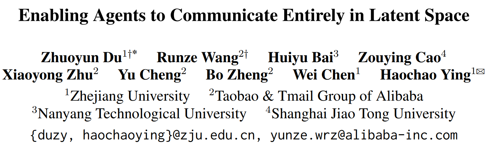
## 核心思想：让智能体直接在 latent space 中通信
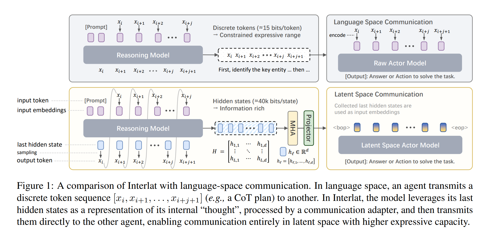
## 图一：文本通信与潜空间通信的区别
### 整体结构
上半部分：Language Space Communication（传统方法）
Agent A → 文本 → Agent B
下半部分：Latent Space Communication（Interlat方法）
Agent A → hidden states → Agent B

token ≈ 15 bits vs latent ≈ 40k bits

#### 上半部分：语言通信
流程：Prompt → Reasoning Model → 生成文本 token → Actor Model → 输出结果
具体过程：
1. [Prompt] x_i x_{i+1}  x_{i+2}
2. Reasoning agent生成CoT（Chain of Thought）$x_i ... x_{i+j+1}$
3. Actor agent读取文本 token → embedding → 理解 → 输出答案
#### 下半部分：潜空间通信
流程： Prompt → Reasoning Model → hidden states → Actor Model → 输出结果
具体过程：
1. [Prompt] x_i  x_{i+1}  x_{i+2}

2. Reasoning agent生成hidden states $h_1 ... h_L$，L是生成的token数量
作者定义：
$$H = [h_1, h_2, ... , h_L]，h_l ∈ R^d，H ∈ R^{L × d}$$
> 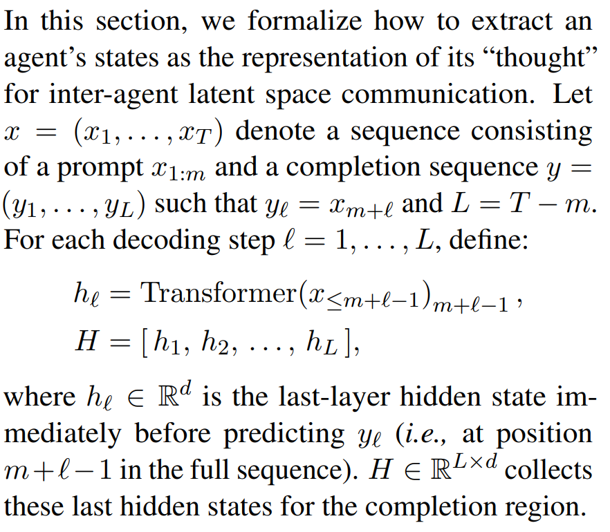
定义整个输入序列$x = (x_1, \dots , x_T)$，
包含两部分 prompt + completion(模型生成部分) $x = (x_1,\dots,x_m, y_1,\dots,y_L)$
并且定义
$$y_\ell = x_{m+\ell}$$
生成token y1 实际上是序列里的 x_{m+1}
生成token y2 是 x_{m+2}
$$ h_\ell = Transformer(x_{\le m+\ell-1})_{m+\ell-1} $$
输入：前面的所有token
输出：预测下一个token
生成y1 时，输入是x1...xm，输出是h1
生成y2 时，输入是x1...xm y1，输出是h2

3. MHA + Projector
作用：允许 Actor 动态选择和读取 reasoning 信息 + 对齐不同agent之间的hidden space

4. 插入到Actor输入
把 hidden states 直接当作 embedding 输入
>$$\begin{aligned}
>E=[e(x_1),\ldots,e(x_i),h_1,h_2,\ldots,h_L,e(x_j)],
>\end{aligned}$$

tips: $e(x_j)$ 是当前 step 的 query token，Actor Agent 需要一个“task token”$e(x_j)$。

## 整体训练流程
### 损失函数
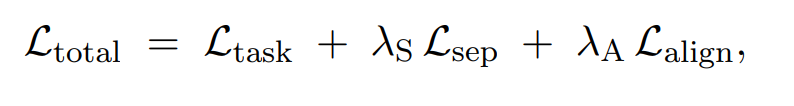

#### action Loss
标准CrossEntropy Loss，监督模型生成正确的答案
作用：约束 Actor 的最终输出必须正确

#### distribution divergence loss
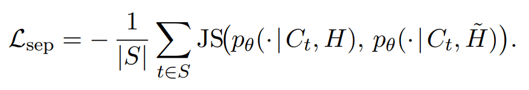

H为正确match的latent ， H'为dismatch的latent
目的：让p(y|C,H) ≠ p(y|C,H')，正确的思维和错误的思维应该产生不同的输出分布

#### alignment loss
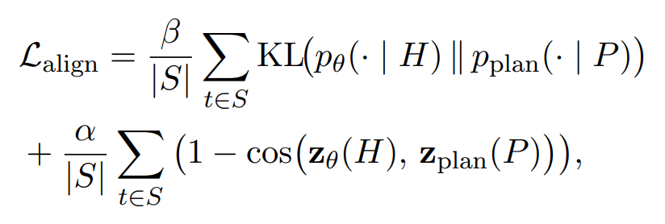

P = reasoning model 生成的 CoT / plan
目的：p(y|C,H) ≈ p(y|C,P)，latent思维要与语言思维一致

#### Curriculum Learning
不要一开始就让模型完全依赖 latent（h），而是逐步从 token embedding（e）过渡到 latent。
$H^{(r)} = e_1, \dots, e_{\lfloor rL \rfloor} \;\oplus\; h_{\lfloor rL \rfloor +1}, \dots, h_L$, $r \in \{0, 0.1, ..., 1.0\}$
通过“token→latent 的逐步替换”，让模型从熟悉的输入分布平滑过渡到完全 latent 输入

>逐步将token嵌入替换为隐式表征。靠前的位置仍保留基于token的表征，以提供稳定的语义锚点；而靠后的位置则转而采用隐式表征，旨在引导模型学习对隐式信息的解读。这种渐进式的替换策略不仅能稳定训练过程，还能促成向完全基于隐式表征的通信模式的平滑过渡。

## 图二：训练压缩推理模型
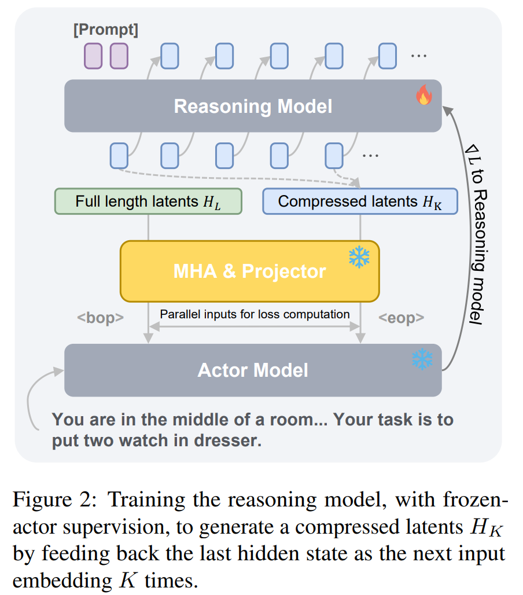

目的：让压缩后的 latent（HK）仍然具备 reasoning 能力 
$\text{Reasoning}(H_K) \approx \text{Reasoning}(H_L)$
重点：为什么HK和HL需要同时进入MHA&Projector?（parallel inputs for loss computation） 
MHA 的本质是“对齐（alignment）+ 对比（contrast）”，必须同时看到 HK 和 HL ，才能学习它们之间的语义对应关系
通过交叉注意力机制（$Q = H_K,\quad K,V = H_L$或者$Q = H_L,\quad K,V = H_K$），实现token-level对齐
提供教师信号：让完整信息的HL（teacher）可以指导丢失信息的HK（student）

### 训练的loss函数
$$\mathcal{L}_{compress} = \lambda_{task} \mathcal{L}_{task} + \lambda_{pref} \mathcal{L}_{pref} + \lambda_{geom} \mathcal{L}_{geom}$$

#### 任务损失 $\mathcal{L}_{task}$
作用：$\text{Actor}(H_K) \approx \text{正确输出}$ 即使压缩，HK仍然能完成任务

#### 偏好损失 $\mathcal{L}_{pref}$
作用：$\text{Actor}(H_K) \approx \text{Actor}(H_L)$ 和原推理风格一致

#### 几何损失 $\mathcal{L}_{geom}$
作用：$H_K \approx H_L \quad (\text{在 latent 空间})$ latent 空间的语义结构不被破坏

## 实验结果与性能
### 对比实验
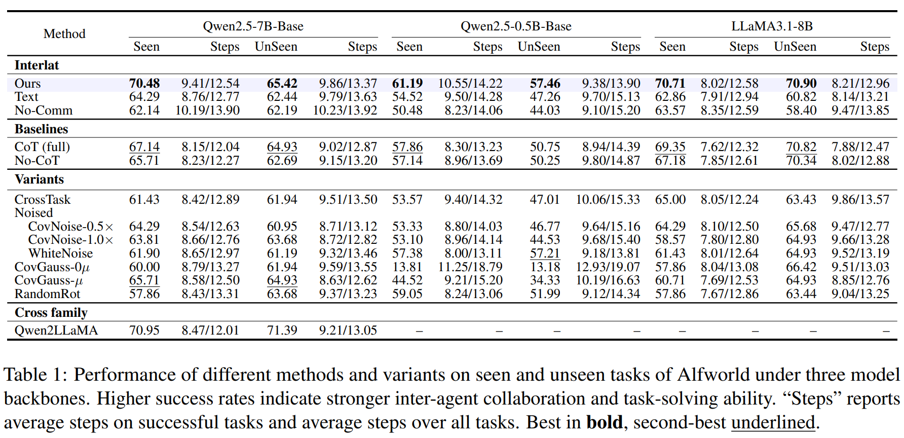
验证多个模型上Latent communication 显著提升任务成功率，并优于传统 CoT 通信，trajectory 更长但成功率更高

### aha moment 让模型学会使用latent
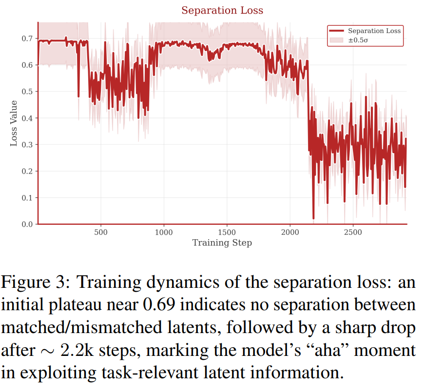

模型在前2.2k步分不清H与H'，后2.2k步才学会区分正确的latent和错误的latent，说明模型确实学会了利用潜空间信息进行推理，而不是简单地依赖输入文本。

###  可视化latent空间
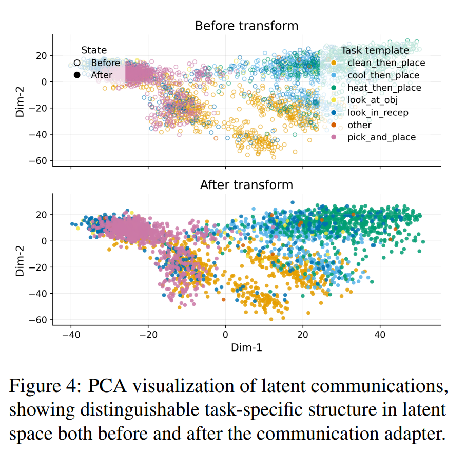

### 压缩效率实验
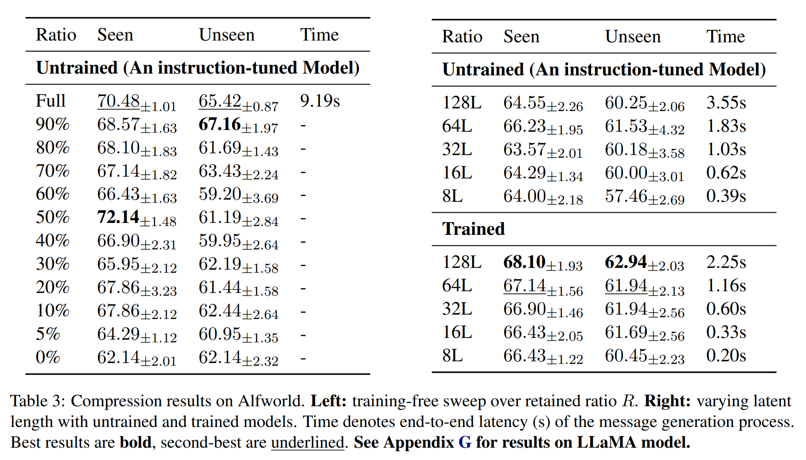
**Untrained (An instruction-tuned Model)：没有训练任何 compression 模型,截断 / 保留一部分 latent**
**Trained： 专门训练一个模型去“生成压缩后的 latent”**
full用时9.19s，压缩到8L后用时0.39s，实现了24× inference speedup

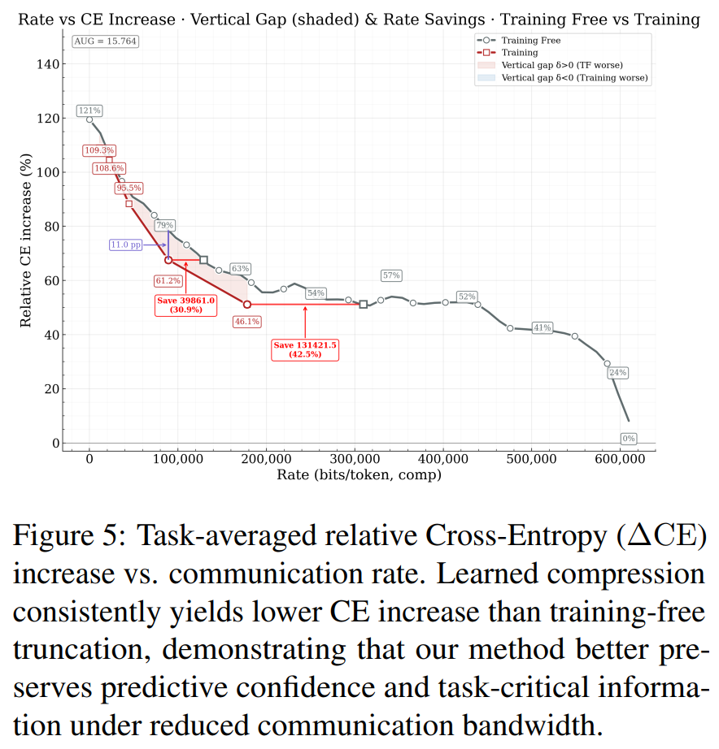

横坐标：communication rate
纵坐标：$\Delta CE = \frac{CE_{compressed} - CE_{full}}{CE_{full}}$
曲线1：Trained compression（红色）：学习得到的压缩
曲线2：Truncation（灰色）：直接裁剪（Untrained）

红线始终低于灰线：学习压缩能够更好的保留信息，latent是高度冗余但是具有结构性的，经过学习的压缩能够保留重要信息，而直接裁剪会丢失更多关键信息，导致性能显著下降
**经过恰当学习，压缩并不会显著增加不确定性；这表明大多数潜在维度虽然冗余，但具有结构性。**

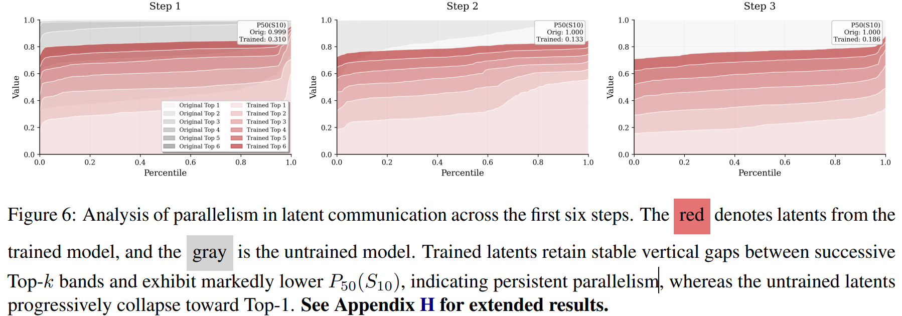
每一步latent：画出 Top-k token probability distribution
Untrained：
概率迅速集中到 top-1
其他 token 概率接近 0
**single-path reasoning（单路径）**

Trained：
top-k 之间保持间距
概率分布更“平”
**multi-path reasoning（多路径）**
压缩后仍然保留了“多个候选推理路径”

### 损失函数设计消融实验
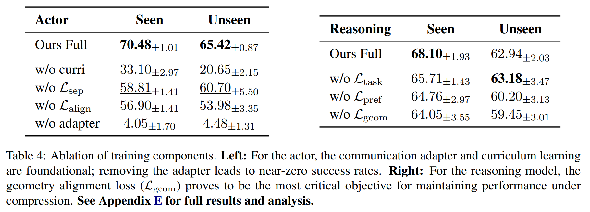