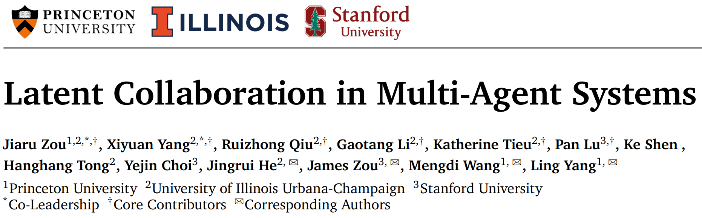
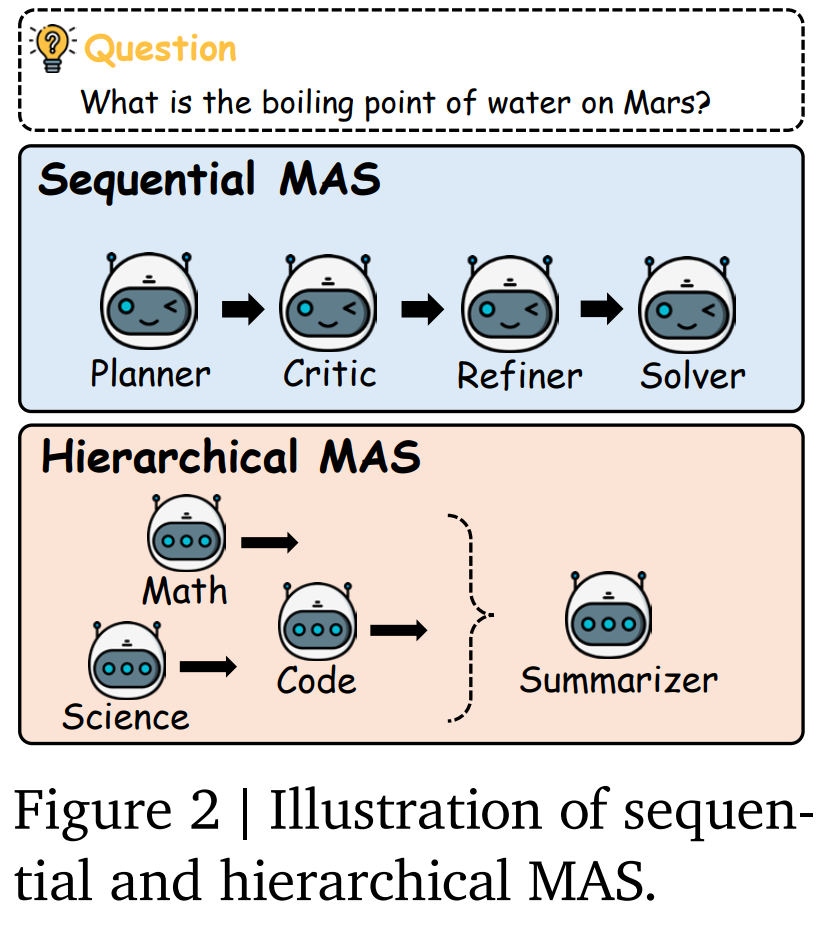
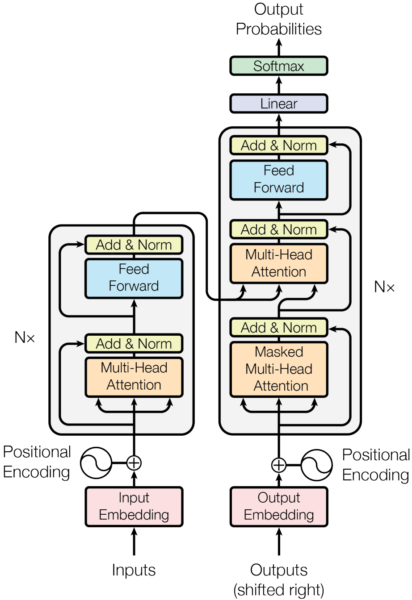
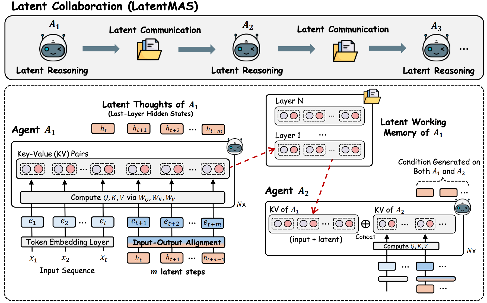
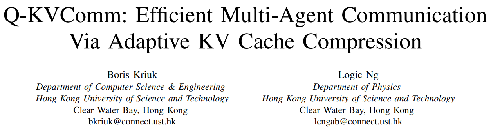
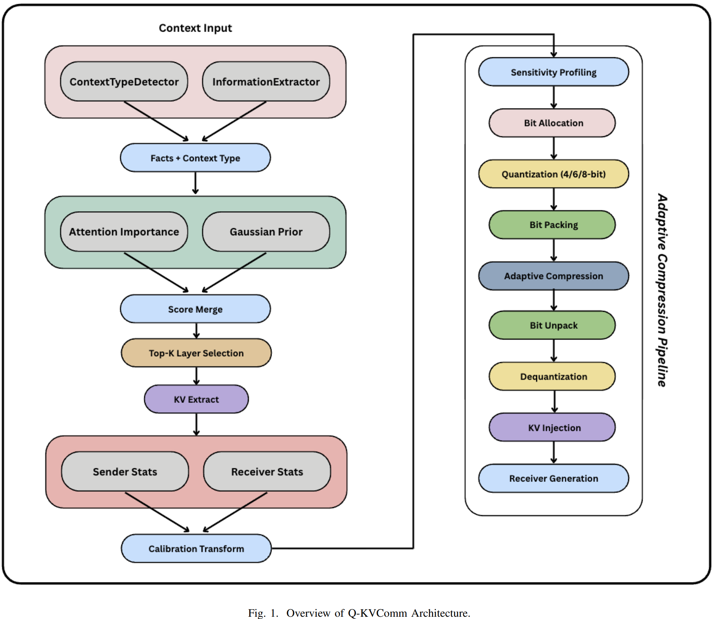
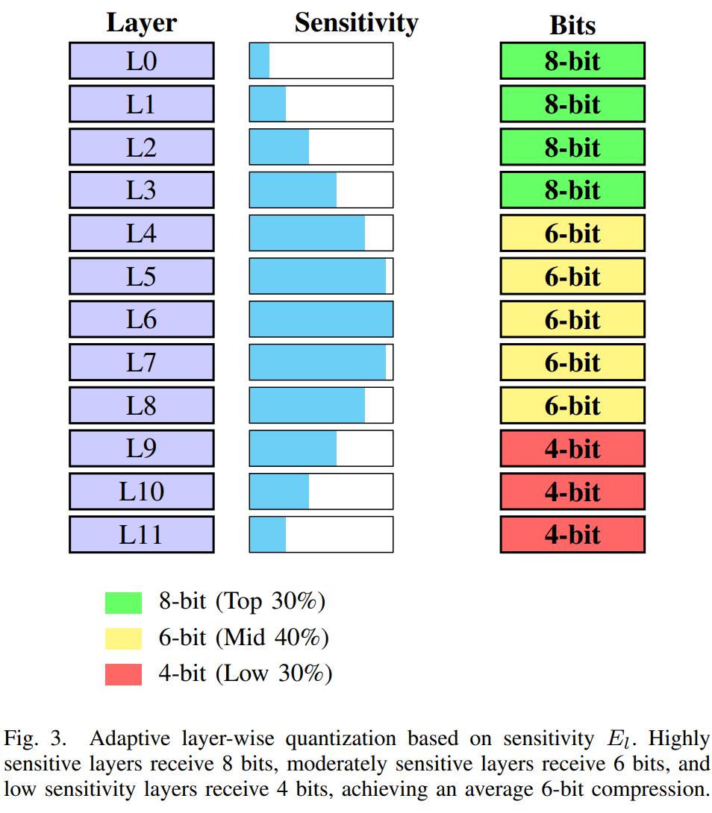

## 
**核心思想：让多个LLM在“潜空间”直接交流**
### 传统多智能体系统（基于文本）
Agent1 → 生成文本 → Agent2读取文本 → 再生成文本 → Agent3

### 本文提出的LatentMAS系统 
**Latent Collaboration（潜空间协作）**
Agent1 hidden states → Agent2 （模型直接在 hidden state 里交流）

### 什么是潜空间信息

例如：
输入token "hello world" → 经过embedding层 → 转换成e1 e2 e3 ... → 经过transformer层 → 转换成h1 h2 h3 ...（潜空间信息）
潜空间信息包含了输入文本的语义、上下文等丰富信息，模型直接在潜空间中进行交流和协作，而不需要将信息转换回文本形式。

**思维链**
输入token embedding
        ↓
Transformer
        ↓
hidden state ht
        ↓
映射回embedding $e_{t+1}=h_t W_a$
        ↓
作为下一步输入
        ↓
生成新的hidden state
h_(t+1), h_(t+2) ... h_(t+m)

### KVcache是什么
KVcache是Transformer模型中的一个机制，用于存储和管理模型在生成过程中产生的键（Key）和值（Value）。在Transformer中，每一层都会生成一组键和值，这些键值对用于计算注意力权重，从而决定模型在生成下一个token时应该关注输入序列的哪些部分。

$$\mathrm{Attention}(Q,K,V)=\mathrm{softmax}(\frac{QK^T}{\sqrt{d_k}})V$$
结构：
K_cache = [K1 K2 K3 ... Kt]
V_cache = [V1 V2 V3 ... Vt]
生成新的token时候，只用计算Kt+1和Vt+1，然后将它们添加到KVcache中，避免了重复计算之前的键值对，提高了生成效率。
Kcache ← [K≤t ; Kt+1]
Vcache ← [V≤t ; Vt+1]
**本文的关键思想：把 KV cache 当成“工作记忆”**

### 潜在工作记忆（latent working memory）
原文公式：
$$\begin{aligned} \mathcal{M}_{A_{1}} & =\left\{\left(K_{A_{1},\mathrm{cache}}^{(l)},V_{A_{1},\mathrm{cache}}^{(l)}\right)|l=1,2,\ldots,L\right\}, \\ & \mathrm{where~}K_{A_{1},\mathrm{cache}}^{(l)}=[K_{A_{1},1}^{(l)},\ldots,K_{A_{1},t+m}^{(l)}],\quad V_{A_{1},\mathrm{cache}}^{(l)}=[V_{A_{1},1}^{(l)},\ldots,V_{A_{1},t+m}^{(l)}]. \end{aligned}$$

cache里包含了输入token + latent thoughts 所以memory = input context + reasoning states
> the collection of layer-wise caches in M𝐴1 encapsulates both the initialinput context and the newly generated latent thoughts of agent 𝐴1.

### 基于 KV 缓存的潜在工作记忆传递机制
**流程框架图：**

**Step1：Agent A1 生成潜在思维**
Agent A1 输入问题：q=question → 做 m 步 latent reasoning 生成潜在思维：h_(t+1), h_(t+2) ... h_(t+m) → Transformer层生成新的KV cache：
K_cache_A1, V_cache_A1 包含
[K1 K2 ... K_(t+m)]
[V1 V2 ... V_(t+m)]
cache包含输入语义和推理轨迹

**Step2：提取潜在工作记忆传递给Agent A2**
M_A1 = {(K_A1^l, V_A1^l)}
Agent1 KV → Agent2

**Step3：拼接cache Agent2进行推理**
Agent2 attention 看到：[Agent1 memory | Agent2 memory]，Self-attention：Q_A2 · K_total，所以Agent2可以访问Agent1的memory，直接 attention 到 Agent1 的 latent thoughts，无需文本转换。

**完整信息流**
Question
   ↓
Agent1
   ↓
latent thoughts
   ↓
KV cache
   ↓
Agent2
   ↓
latent thoughts
   ↓
KV cache
   ↓
Agent3
   ↓
...
   ↓
最后一个Agent
   ↓
decode text

### 为什么 KV cache 能代表完整信息
$\mathrm{Attention}(Q,K,V)=\mathrm{softmax}(\frac{QK^T}{\sqrt{d_k}})V$
其中Q是当前Agent的查询，K是之前Agent的memory，V是之前Agent的value。通过计算注意力权重，当前Agent可以直接访问之前Agent的潜在思维（latent thoughts），从而实现信息的无缝传递和协作。所以KV cache不仅包含了输入的语义信息，还包含了之前Agent的推理轨迹和思维状态，能够完整地代表之前Agent的工作记忆。

## 
**一种 基于 KV cache 的表示通信协议**

### Agent通信流程
文本 → Transformer → KV cache → 压缩KV cache → 发送给另一Agent → 直接继续推理
但 KV cache 很大，所以需要压缩。

Transformer每一层都由KVcache产生，但并不是所有层都重要，论文提出一个层重要度评分
$$S_l = \alpha S_l^a + (1-\alpha)P_l$$
其中
（1）Attention importance
$$S_l^a = \frac{1}{HT} \sum_{h=1}^{H}\sum_{t=1}^{T} A_{l,h,t}$$
表示该层 attention 的平均强度
（2）Gaussian prior
经验上，Transformer的中间层更重要，所以引入一个高斯先验分布
$$P_l = e^{-(l-\mu)^2/(2\sigma^2)}$$
其中 $\mu$ 是高斯分布的均值，$\sigma$ 是标准差，控制了分布的宽度。通过调整 $\alpha$ 的值，可以平衡 attention 重要性和高斯先验的重要性，从而选择最重要的层进行通信。

> The top thirty percent most sensitive layers receive maximum bits (typically 8-bit),the middle forty percent receive target bits (typically 6-bit),and the bottom thirty percent least sensitive layers receive minimum bits (typically 4-bit)

### Heterogeneous Model Calibration（跨模型通信）
论文中提出不同 agent 可能使用不同模型：它们hidden space不一样，直接传KV会语义不对齐论文提出一个简单的分布对齐：
$$KV_{cal} = \frac{KV_s - \mu_s}{\sigma_s} \times \sigma_r + \mu_r$$
本质上是对源模型的KV进行标准化，然后再根据目标模型的分布进行重新缩放和平移，使得不同模型之间的KV能够更好地对齐，从而实现跨模型的通信。

### pipeline
Sender Agent
     │
1 Transformer forward
     │
2 Layer Selection
     │
3 Information Extraction
     │
4 Adaptive Quantization
     │
5 Bit Packing
     │
6 Transmission
     │
Receiver Agent
     │
7 Dequantization
     │
8 Calibration
     │
9 KV cache concat
     │
继续推理

test