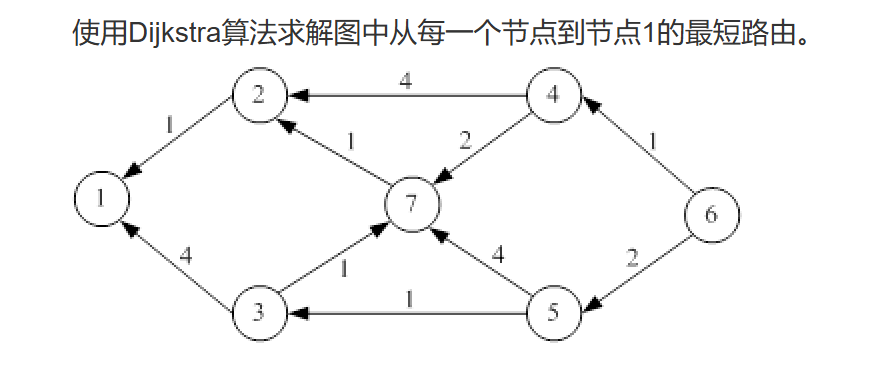

先将图中的所有有向边反向，然后以节点 1 为源点使用 Dijkstra 算法。这样在反向图中求得的“节点 1 到各节点的最短路径”，等价于原图中“各节点到节点 1 的最短路径”。

---

## 1. Dijkstra 标号过程

反向图中从节点 1 出发，Dijkstra 算法的标号过程如下：

| 步骤 | 选入节点 | \(D_2\) | \(D_3\) | \(D_4\) | \(D_5\) | \(D_6\) | \(D_7\) |
|---|---|---:|---:|---:|---:|---:|---:|
| 初始 | 1 | 1 | 4 | ∞ | ∞ | ∞ | ∞ |
| 1 | 2 | 1 | 4 | 5 | ∞ | ∞ | 2 |
| 2 | 7 | 1 | 3 | 4 | 6 | ∞ | 2 |
| 3 | 3 | 1 | 3 | 4 | 4 | ∞ | 2 |
| 4 | 4 | 1 | 3 | 4 | 4 | 5 | 2 |
| 5 | 5 | 1 | 3 | 4 | 4 | 5 | 2 |
| 6 | 6 | 1 | 3 | 4 | 4 | 5 | 2 |

---

## 2. 各节点到节点 1 的最短路径

| 起点 | 到节点 1 的最短路径 | 最短距离 | 下一跳 |
|---|---|---:|---|
| 1 | \(1\) | 0 | — |
| 2 | \(2 \to 1\) | 1 | 1 |
| 3 | \(3 \to 7 \to 2 \to 1\) | 3 | 7 |
| 4 | \(4 \to 7 \to 2 \to 1\) | 4 | 7 |
| 5 | \(5 \to 3 \to 7 \to 2 \to 1\) | 4 | 3 |
| 6 | \(6 \to 4 \to 7 \to 2 \to 1\) | 5 | 4 |
| 7 | \(7 \to 2 \to 1\) | 2 | 2 |

---

## 3. 最终结果

因此，原图中各节点到节点 1 的最短距离为：

\[
D_1=0,\quad D_2=1,\quad D_3=3,\quad D_4=4,\quad D_5=4,\quad D_6=5,\quad D_7=2
\]

对应的最短路径为：

\[
\begin{aligned}
1 &: 1 \\
2 &: 2 \to 1 \\
3 &: 3 \to 7 \to 2 \to 1 \\
4 &: 4 \to 7 \to 2 \to 1 \\
5 &: 5 \to 3 \to 7 \to 2 \to 1 \\
6 &: 6 \to 4 \to 7 \to 2 \to 1 \\
7 &: 7 \to 2 \to 1
\end{aligned}
\]